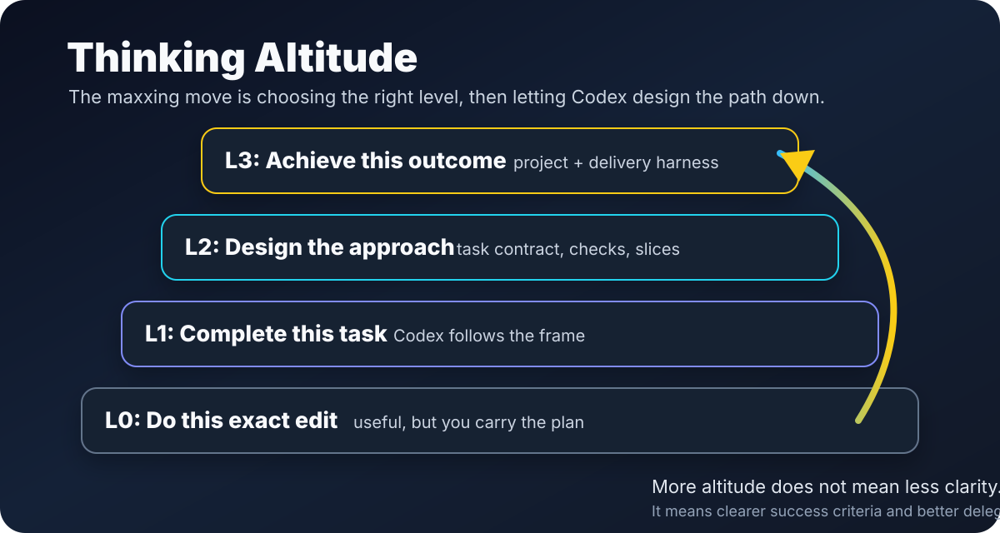

# Codexmaxxing

Using Codex less like a chatbot and more like an agentic operating system.

Codexmaxxing is my field guide for getting real work done with Codex: apps, firmware, docs, ops, writing, research, repo cleanup, weird little side quests, and the occasional "why is this thing broken at 11pm?" investigation.

The big unlock is altitude. With a strong enough model, the useful move is often not "write a better tiny task." It is "hold the goal at the right level, make success clear, and let Codex design the harness underneath it."

## Start Here

- [The Codexmaxxing Loop](guides/codexmaxxing-loop.md): the basic loop I keep coming back to.
- [Thinking Altitude](guides/thinking-altitude.md): the biggest unlock: giving Codex bigger goals at the right level.
- [Task Framing For Agents](guides/task-framing.md): how to stop asking vague stuff and start getting useful work back.
- [Context Control](guides/context-control.md): how to stop drowning Codex in the wrong information.
- [Verification Before Completion](guides/verification-before-completion.md): the part that turns "seems fine" into "actually done."
- [Example Missions](examples/README.md): a few shapes for real work, including non-code work.
- [Related Projects](docs/related-projects.md): real repos where these ideas show up.

## The Shape Of It

That loop works for code, but it is not just a coding thing.

I use the same pattern for:

- turning broad ideas into product-shaped side projects,
- debugging live systems,
- turning messy notes into useful docs,
- researching gear or APIs,
- shaping open-source repos,
- reviewing UI,
- making tiny scripts that replace annoying repeated thinking,
- and generally moving more work out of my head and into a repeatable loop.

## The Fun Part

The fun bit is when Codex stops being a novelty and starts becoming part of the bench:

- a repo has instructions that actually help,
- a goal has success criteria,
- Codex can derive the task contract instead of waiting for me to handwrite every field,
- a tool call reads the live thing instead of guessing,
- a test or screenshot catches the dumb mistake,
- a repeated workflow turns into a reusable playbook,
- and suddenly the agent can do more than autocomplete code.

This repo is a mix of notes, patterns, templates, and examples for that.

## Grab A Thing

| If you want to... | Start with |
| --- | --- |
| think bigger without going vague | [Thinking Altitude](guides/thinking-altitude.md) |
| get better answers from Codex | [Task Framing For Agents](guides/task-framing.md) |
| stop context chaos | [Context Control](guides/context-control.md) |
| build a repeatable setup around a repo | [Build A Codex Operating System](guides/build-a-codex-operating-system.md) |
| use tools, skills, and MCP without making a mess | [Tools, Skills, And MCP](guides/tools-skills-and-mcp.md) |
| split work across agents without making it worse | [Delegation And Subagents](guides/delegation-and-subagents.md) |
| bring this into a team | [Team Adoption](guides/team-adoption.md) |
| copy a template and go | [Copy-Paste Bits](resources/README.md) |
| see what this looks like in practice | [Example Missions](examples/README.md) |

## Real-World-ish Examples

- [Moodarr](https://github.com/jremick/moodarr): a Plex + Seerr companion app shaped around fixture mode, request safety, and release checks.
- [DragyDash](https://github.com/jremick/dragy-dash): an iOS telemetry dashboard where Codex had to deal with BLE, simulator UI, and physical-device proof.
- [DragyDash ESP32](https://github.com/jremick/dragy-dash-esp32): firmware for a tiny display, where "it compiles" is nowhere near enough.
- [AI Workbench](https://github.com/jremick/ai-workbench): sibling repo for skills, harnesses, memory patterns, and reusable agentic-work artifacts.
- [AI Skills Share](https://github.com/jremick/ai-skills-share): a registry/product surface for publishing, reviewing, discovering, installing, and using agent skills.

More notes on those are in [Related Projects](docs/related-projects.md).
