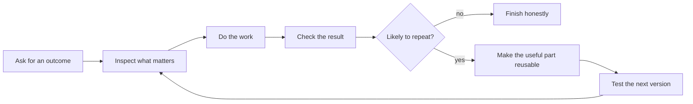

# Codexmaxxing

A practical guide to using Codex for real work—and turning the workflows that matter into reliable, reusable systems.

Codexmaxxing is a field guide for getting real work done with Codex: software, devices, documentation, operations, writing, research, repository maintenance, and the occasional difficult investigation.

The pattern I keep coming back to is simple: say what should be true, make the important boundaries clear, and let Codex work out the path underneath. For a one-off task, that may be all you need. When the same work keeps coming back, the useful parts can move into instructions, skills, scripts, checks, and other reusable pieces so the next run starts stronger.

Durable operating principles are kept separate from current-product guidance. Product behavior was last checked against official OpenAI documentation on 2026-08-20; availability can vary by host, account, plan, operating system, and rollout.

> **Public alpha:** This is an independent, unofficial field guide, not an OpenAI product or a substitute for official documentation. The structure and examples are usable, but product-specific guidance may change as Codex evolves. No versioned release has been published.

## Start Here

If you want to use Codex better today, start with [The Codexmaxxing Loop](guides/codexmaxxing-loop.md), [Thinking Abstraction Level](guides/thinking-abstraction-level.md), and the [Example Missions](examples/README.md).

If the same workflow or failure keeps returning, move into [From Prompts To Compounding Systems](guides/from-prompts-to-compounding-systems.md). That is where the guide gets into reusable harnesses, workflow graphs, shared vocabularies, evals, and controlled improvement.

If you are trying to understand a current Codex feature—such as projects, scheduled tasks, skills, plugins, subagents, worktrees, Browser, or Computer Use—use the [complete guide index](guides/README.md). Product-specific pages are dated and link back to current official sources.

## The Shape Of It

That loop works for code, but it is not just a coding thing.

The same pattern applies to:

- turning broad ideas into product-shaped projects,
- debugging live systems,
- turning messy notes into useful docs,
- researching gear or APIs,
- shaping open-source repos,
- reviewing UI,
- making small scripts that replace repeated manual work,
- and turning recurring work into a repeatable loop.

## The Fun Part

The fun bit is when Codex stops being a novelty and starts becoming part of the bench:

- a repo has instructions that actually help,
- a goal has success criteria,
- Codex can work out a sensible plan without every step being written in advance,
- parallel work has clear owners, boundaries, and handoffs instead of vibes,
- a tool call reads the live thing instead of guessing,
- a test or screenshot catches the dumb mistake,
- a repeated workflow turns into a reusable playbook,
- a recurring failure becomes an eval instead of another reminder,
- a tested improvement makes the next comparable run better,
- and suddenly the agent can do more than autocomplete code.

This repo is a mix of notes, patterns, templates, and examples for that.

## Choose What You Need

| If you want to... | Start with |
| --- | --- |
| organize ongoing context, long-running work, or recurrence | [Projects, Chats, Goals, And Scheduled Tasks](guides/projects-chats-goals-and-schedules.md) |
| choose between the current checkout, isolated Git work, and remote execution | [Local, Worktree, And Cloud Environments](guides/environments-worktrees-and-cloud.md) |
| choose instructions, a script, skill, plugin, MCP connector, or schedule | [Skills, Plugins, MCP, And Tools](guides/skills-plugins-mcp-and-tools.md) |
| control a website or graphical application | [Browser, Computer Use, And Structured Connectors](guides/browser-computer-use-and-connectors.md) |
| select reasoning depth or parallel delegation | [Models, Reasoning, And Delegation](guides/models-reasoning-and-delegation.md) |
| split work without creating coordination debt | [Delegation And Subagents](guides/delegation-and-subagents.md) and [Parallel Projects And Agent Teams](guides/parallel-projects-and-agent-teams.md) |
| understand instructions, permissions, rules, and hooks | [Permissions, Rules, Hooks, And Instructions](guides/permissions-rules-and-hooks.md) |
| create a file, interactive explanation, or hosted experience | [Artifacts, Sites, And Visualizations](guides/artifacts-sites-and-visualizations.md) |
| design a large skill library without flooding context | [Capability Lifecycle And Prompt Visibility](guides/capability-lifecycle.md) |
| turn repeated work into a system that can improve safely | [From Prompts To Compounding Systems](guides/from-prompts-to-compounding-systems.md), [Workflow Graphs, Shared Vocabulary, And Harnesses](guides/graph-and-ontology-engineered-harnesses.md), and [Verified Improvement Loops](guides/verified-improvement-loops.md) |

The complete [guide index](guides/README.md), [copyable resources](resources/README.md), and [synthetic missions](examples/README.md) provide the rest.

## Synthetic Work Patterns

- Prepare an application repository so a contributor can run it without private infrastructure.
- Diagnose a layered system failure with read-only evidence before changing anything.
- Verify a device workflow on the real target instead of stopping at source inspection.
- Turn a repeated workflow into a reusable skill, checklist, or validator.
- Turn a recurring failure into a regression eval and a reviewed workflow improvement.
- Coordinate independent workstreams without overlapping write boundaries.

These are expanded in [Example Work Patterns](docs/example-work-patterns.md). The examples are synthetic and do not describe a specific person, repository, organization, or environment.

## Current Status And Support

Codexmaxxing is in public alpha. The durable operating patterns are intended for inspection, adaptation, and feedback; product-specific details are dated and should be checked against the cited official sources before use.

Known limitations:

- Codex features and availability can differ by host, plan, account, operating system, and rollout.
- Examples are synthetic teaching material, not evidence that a workflow will fit every environment.
- Automated validation catches defined content and repository risks but cannot prove complete anonymity, factual completeness, accessibility, or visual quality.
- There is no versioned release, compatibility guarantee, or support service.

Use the repository's Issues tab for documentation defects, outdated guidance, or concrete improvement proposals. See [Contributing](CONTRIBUTING.md) for public-safe contribution expectations and [Security Policy](SECURITY.md) for private reporting guidance. No response time is guaranteed.

## License

[Apache License 2.0](LICENSE)
