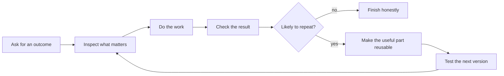

# Codexmaxxing

A practical guide to getting real work done with AI agents.

Codex is the tool I prefer and the focus of this repo, but the ideas are broader: state the outcome clearly, give the agent the right context and tools, check the real result, and make useful patterns reusable.

The pattern I keep coming back to is simple: say what should be true, make the important boundaries clear, and let Codex work out the path underneath. For a one-off task, that may be all you need. When the same work keeps coming back, the useful parts can move into instructions, skills, scripts, checks, and other reusable pieces so the next run starts stronger.

## Start Here

If you want to use Codex better today, start with [The Codexmaxxing Loop](guides/codexmaxxing-loop.md), [Thinking Abstraction Level](guides/thinking-abstraction-level.md), and the [Example Missions](examples/README.md).

If the same workflow or failure keeps returning, move into [From Prompts To Compounding Systems](guides/from-prompts-to-compounding-systems.md). That is where the guide gets into reusable harnesses, workflow graphs, shared vocabularies, evals, and controlled improvement.

If you are trying to understand a current Codex feature—such as projects, scheduled tasks, skills, plugins, subagents, worktrees, Browser, or Computer Use—use the [complete guide index](guides/README.md). Product-specific pages are dated and link back to current official sources.

## The Shape Of It

That loop works across all kinds of work, not just code.

The same pattern applies to:

- researching a decision from current sources,
- comparing products, services, routes, or other options against real constraints,
- turning rough notes, voice input, or a meeting into a useful document and clear follow-up,
- drafting communication for a specific audience,
- creating documents, spreadsheets, presentations, diagrams, and interactive explanations,
- planning work, travel, purchases, or events without making the final decision for you,
- debugging software, devices, and live services,
- shaping repositories and product work,
- and turning recurring research, admin, review, or delivery work into a repeatable loop.

## The Fun Part

The fun bit is when Codex stops being a novelty and starts becoming part of the bench:

- a repo has instructions that actually help,
- a goal has success criteria,
- Codex can work out a sensible plan without every step being written in advance,
- parallel work has clear owners, boundaries, and handoffs instead of vibes,
- a tool call reads the live thing instead of guessing,
- a test or screenshot catches the dumb mistake,
- a repeated workflow turns into a reusable playbook,
- a recurring failure becomes an eval instead of another reminder,
- a tested improvement makes the next comparable run better,
- and suddenly the agent can do more than answer questions or autocomplete code.

This repo is a mix of notes, patterns, templates, and examples for that.

## Choose What You Need

| If you want to... | Start with |
| --- | --- |
| research, compare options, or turn rough material into a useful result | [Example Missions](examples/README.md) and [Playground Prompts](resources/playground-prompts.md) |
| organize ongoing context, long-running work, or recurrence | [Projects, Chats, Goals, And Scheduled Tasks](guides/projects-chats-goals-and-schedules.md) |
| choose between the current checkout, isolated Git work, and remote execution | [Local, Worktree, And Cloud Environments](guides/environments-worktrees-and-cloud.md) |
| choose instructions, a script, skill, plugin, MCP connector, or schedule | [Skills, Plugins, MCP, And Tools](guides/skills-plugins-mcp-and-tools.md) |
| control a website or graphical application | [Browser, Computer Use, And Structured Connectors](guides/browser-computer-use-and-connectors.md) |
| select reasoning depth or parallel delegation | [Models, Reasoning, And Delegation](guides/models-reasoning-and-delegation.md) |
| split work without creating coordination debt | [Delegation And Subagents](guides/delegation-and-subagents.md) and [Parallel Projects And Agent Teams](guides/parallel-projects-and-agent-teams.md) |
| understand instructions, permissions, rules, and hooks | [Permissions, Rules, Hooks, And Instructions](guides/permissions-rules-and-hooks.md) |
| create a file, interactive explanation, or hosted experience | [Artifacts, Sites, And Visualizations](guides/artifacts-sites-and-visualizations.md) |
| design a large skill library without flooding context | [Capability Lifecycle And Prompt Visibility](guides/capability-lifecycle.md) |
| turn repeated work into a system that can improve safely | [From Prompts To Compounding Systems](guides/from-prompts-to-compounding-systems.md), [Workflow Graphs, Shared Vocabulary, And Harnesses](guides/graph-and-ontology-engineered-harnesses.md), and [Verified Improvement Loops](guides/verified-improvement-loops.md) |

The complete [guide index](guides/README.md), [copyable resources](resources/README.md), and [synthetic missions](examples/README.md) provide the rest.

## Synthetic Work Patterns

- Research a decision using current sources, explicit criteria, and an honest account of uncertainty.
- Plan a trip, purchase, or event around live constraints without treating a search result as a confirmed booking or reservation.
- Turn rough notes, a transcript, or mixed source material into a decision, communication, or finished artifact.
- Run a recurring review in read-only or draft-only mode until a human approves any external action.
- Prepare an application repository so a contributor can run it without private infrastructure.
- Diagnose a layered system failure with read-only evidence before changing anything.
- Turn a repeated workflow into a reusable skill, checklist, or validator.
- Turn a recurring failure into a regression eval and a reviewed workflow improvement.

These are expanded in [Example Work Patterns](docs/example-work-patterns.md). The examples are synthetic and do not describe a specific person, repository, organization, or environment.

## Status And Support

Codexmaxxing is an independent, unofficial field guide, not an OpenAI product or a substitute for official documentation. Product-specific details are dated and should be checked against the cited official sources before use.

Codex-specific product behavior was last checked against official OpenAI documentation on 2026-08-20. Availability can vary by host, account, plan, operating system, and rollout.

Known limitations:

- Codex features and availability can differ by host, plan, account, operating system, and rollout.
- Other agent tools use different capabilities, permissions, and terminology; adapt the patterns rather than assuming feature parity.
- Examples are synthetic teaching material, not evidence that a workflow will fit every environment.
- Automated validation catches defined content and repository risks but cannot prove complete anonymity, factual completeness, accessibility, or visual quality.
- There is no compatibility guarantee or support service.

Use the repository's Issues tab for documentation defects, outdated guidance, or concrete improvement proposals. See [Contributing](CONTRIBUTING.md) for public-safe contribution expectations and [Security Policy](SECURITY.md) for private reporting guidance. No response time is guaranteed.

## License

[Apache License 2.0](LICENSE)
