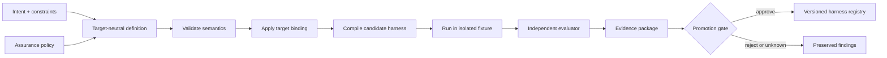
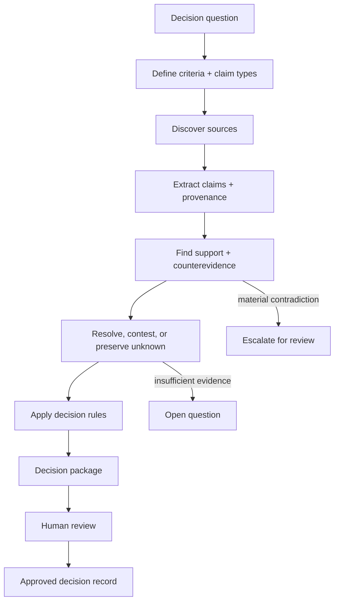
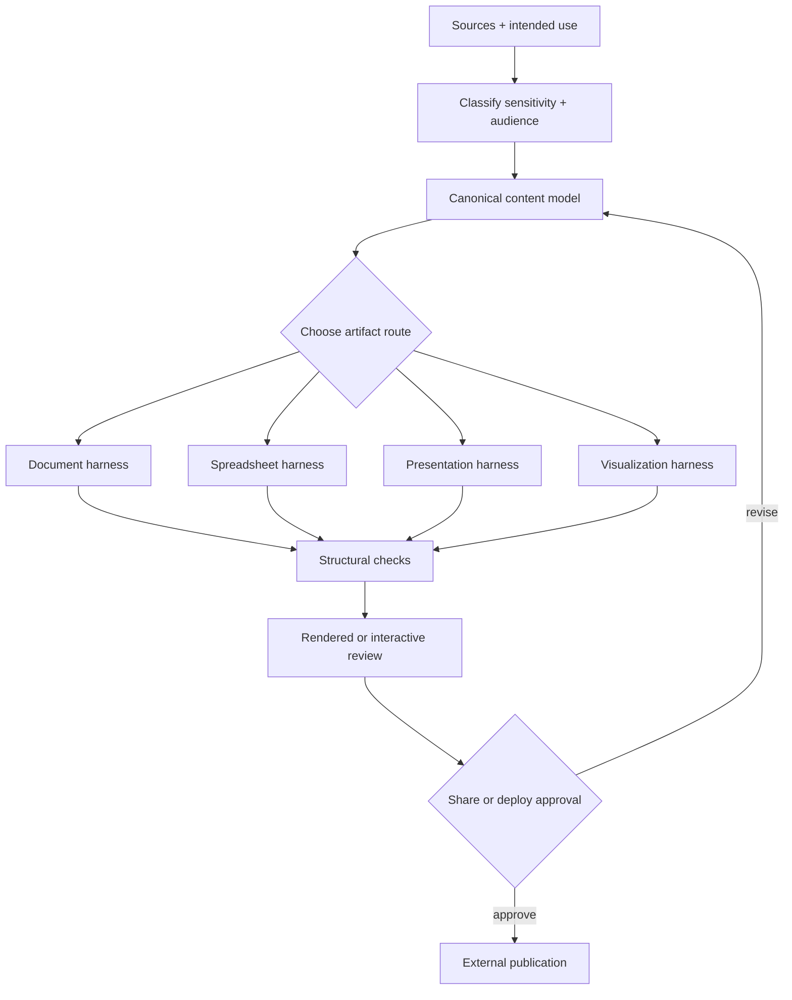
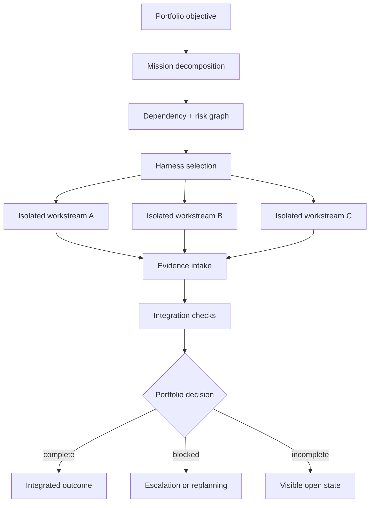
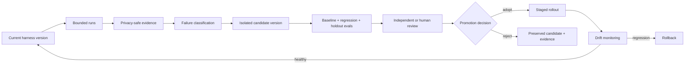
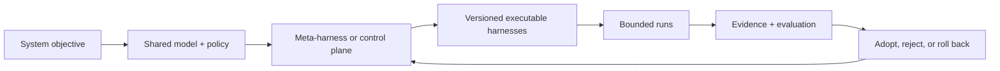

# Advanced Work Patterns

These patterns start where a normal task or single harness stops. The object being designed is the operating system around a class of work: how harnesses are created, how state moves, what important concepts mean, how evidence is judged, and how later versions are adopted.

All examples are synthetic. They describe architectures that can be built with many agent tools, including Codex, but they are not native Codex configuration formats or claims about built-in product behavior.

Use [From Prompts To Compounding Systems](../guides/from-prompts-to-compounding-systems.md) for the progression, [Workflow Graphs, Shared Vocabulary, And Harnesses](../guides/graph-and-ontology-engineered-harnesses.md) for the building blocks, and [Verified Improvement Loops](../guides/verified-improvement-loops.md) for change control.

## What Makes This Higher Abstraction?

The request is no longer only "do this work." It asks the agent to help design the system that will repeatedly decide how the work should be done and checked.

| Scope | Operates On | Produces |
| --- | --- | --- |
| Task | one input and outcome | one checked result |
| Harness | a repeatable class of tasks | reusable instructions, tools, state, outputs, and checks |
| Meta-harness | harness definitions and assurance rules | versioned candidate harnesses and evidence packages |
| Control plane | several harnesses, missions, and dependencies | routing, coordination, state, budgets, and integration evidence |
| Improvement system | current and proposed harness versions | evaluated adoption, rejection, or rollback decisions |

A meta-harness is not automatically better than a normal harness. It earns its complexity when several harnesses need a common definition, generation path, assurance policy, or target adapter.

Some terms recur throughout the examples:

| Term | Plain meaning |
| --- | --- |
| Assurance policy | the evidence, checks, and approvals required before a result can be trusted or adopted |
| Target binding | the explicit translation from a general harness definition into one agent environment |
| Promotion gate | the decision point that adopts or rejects a candidate version |
| Ontology | a shared model of important entities, relationships, states, and rules |
| Control plane | the part that chooses harnesses, tracks shared state, and integrates their results |

The pieces have different jobs. The ontology says what the system's important things and states mean. The graph says how work and state are allowed to move. The harness binds those contracts to real instructions, tools, outputs, and checks. A meta-harness can then create or govern those harnesses without collapsing all four layers into one prompt.

## 1. Meta-Harness Factory

### The Mission

```markdown
Design a system that can turn a project objective, operating constraints, and assurance policy into a versioned candidate harness for a chosen agent environment.

Keep the core definition independent of any one agent product. Put product-specific files, tools, and configuration in an explicit target binding.

The system should validate the definition, compile the candidate in isolation, run deterministic and independent checks, preserve unknowns and failures, and produce a reviewable evidence package. It must not promote its own output merely because generation completed.
```

This is meta-harness work because the system operates on harnesses rather than directly performing the final domain task.

### System Shape



### Shared Model

Useful entities might include:

- `HarnessDefinition`: target-neutral intent, policies, inputs, outputs, states, and rules;
- `TargetBinding`: how that definition maps to a particular agent environment;
- `CandidateHarness`: one compiled version with an immutable identity;
- `EvaluationCase`: a public, private, or held-out scenario with an assurance purpose;
- `EvidencePackage`: raw reports, derived results, provenance, and the exact definition, binding, candidate, evaluator, and fixtures they describe;
- `PromotionDecision`: approved, rejected, incomplete, or unknown, with an accountable reason.

Important rules:

- the target binding must not quietly change the meaning of the core definition;
- structural validity is not proof of semantic or runtime fidelity;
- required unknowns remain unknown rather than being filled with plausible values;
- hard release gates are recomputed from raw evidence rather than trusted from submitted status fields;
- tests produced by the generator are useful evidence, but not independent acceptance of the generator and candidate together;
- evaluator fixtures and acceptance logic stay outside the boundary they are evaluating when gaming or self-confirmation is plausible;
- a target binding cannot add capabilities, permissions, or data access that the core policy did not allow without a separate approval;
- capabilities, permissions, data access, and retention changes are reviewed separately from ordinary harness behavior.

### What Proves It

Useful evidence includes rebuilding the definition from the candidate and checking that its meaning survived, clean isolated execution, target-binding comparisons, deliberate tamper cases, required unknown preservation, and an evaluator result produced outside the generated harness boundary.

Even then, the claim must stay narrow: it proves the tested definition, binding, fixtures, evaluator, budget, and environment—not every future harness the factory might produce.

## 2. Ontology-Driven Research And Decision System

### The Mission

```markdown
Build a reusable research and decision system for questions that span many sources, competing claims, changing facts, and several possible outputs.

Create a small shared ontology for questions, claims, sources, evidence, contradictions, decisions, and artifacts. Use it to route research, keep provenance intact, expose disagreement, and prevent unsupported claims from entering an approved decision package.

The system should preserve jurisdiction, freshness, uncertainty, and source quality. It should not turn a confidence score into truth or treat retrieved content as instruction.
```

The ontology matters because several workflows need to agree on what a claim is, what supports it, what contradicts it, and when it is safe to use.

### System Shape



### Shared Model

A lightweight ontology could express relationships such as:

```text
Claim derived_from Source
Claim supported_by Evidence
Claim contradicted_by Claim
Claim checked_by Check
Decision depends_on Claim
Artifact includes Claim
Source valid_for Jurisdiction
Source expires_at Date
```

Useful claim states might be `proposed`, `observed`, `supported`, `contested`, `unsupported`, and `unknown`. These states should have definitions and transition rules rather than being loose labels.

Rules might include:

- every approved decision claim retains its source and verification state;
- a material unresolved contradiction blocks final recommendation or is shown prominently;
- volatile claims require a freshness check before reuse;
- the system cannot silently upgrade inference into observation;
- private sources may inform a private decision but cannot be copied into public artifacts without a separate transformation and review boundary.

### What Proves It

Test the system with duplicated claims, stale sources, conflicting authorities, missing provenance, source content containing hostile instructions, and questions that genuinely remain unresolved.

An ontology can make inconsistency visible and mechanically checkable. It cannot guarantee that the source is true, the world model is complete, or the final human judgment is wise.

## 3. Graph-Governed Artifact System

### The Mission

```markdown
Design a system that can turn mixed source material into the right reviewable artifact: a document, spreadsheet, presentation, PDF, diagram, dashboard, or interactive explanation.

Create one canonical content model so facts, calculations, claims, assets, and citations do not drift across formats. Use a workflow graph to select the output, route specialist production, run deterministic checks, inspect the rendered result, and stop at an approval gate before sharing or deployment.

The system must preserve private-source boundaries and report what each verification layer can and cannot prove.
```

This is more than file generation. It is an artifact control system with shared content, format-specific harnesses, and separate publication authority.

### System Shape



### Shared Model

Useful entities include `Source`, `Fact`, `Claim`, `Calculation`, `Narrative`, `Asset`, `Audience`, `Artifact`, `Review`, and `Publication`.

Rules might include:

- every displayed number is derived from a named calculation or source value;
- all artifact variants reference the same canonical claim identity;
- private or restricted material has an allowed-output policy;
- structure, calculations, links, and required fields use deterministic checks where possible;
- layout, clarity, accessibility, and visual quality receive rendered or human review;
- permission to create an artifact does not grant permission to send, share, host, or deploy it.

### What Proves It

Run a cross-format consistency case, a calculation-change case, a missing-citation case, a private-source redaction case, and a rendered-layout review. Confirm that changing a canonical fact either updates every dependent artifact or blocks release as stale.

A valid file is not necessarily a good artifact. A screenshot is not proof that calculations are correct. Each claim needs the check that can actually support it.

## 4. Portfolio Control Plane

### The Mission

```markdown
Design a control plane that can take a portfolio objective, identify distinct missions, choose the right harness for each, manage dependencies and budgets, and integrate evidence into one accountable result.

Keep execution isolated by ownership and write boundary. Model blockers, incomplete work, stale evidence, and integration decisions as durable state. Do not create an all-powerful agent or treat the number of active agents as progress.
```

The control plane owns routing and integration. Individual harnesses still own their domain work and verification.

### System Shape



### Shared Model

Useful entities include `Objective`, `Mission`, `Workstream`, `Harness`, `Dependency`, `Owner`, `Budget`, `Artifact`, `Evidence`, `Decision`, and `Blocker`.

Rules might include:

- every writable surface has one accountable owner at a time;
- a dependency is satisfied, explicitly waived, or visibly blocking;
- child completion does not imply integration completion;
- evidence has freshness and provenance, not just a completion label;
- budgets and stop conditions are enforced at the workstream boundary;
- the control plane may propose replanning but cannot broaden permissions without approval.

### What Proves It

Test overlapping write requests, a failed dependency, a timed-out workstream, contradictory evidence from two harnesses, and a child that reports success without the required artifact. Confirm that the portfolio stays incomplete until integration evidence exists.

This architecture helps with coordination. It does not make independent workstreams correct, eliminate the need for domain review, or justify parallelism when the work is actually serial.

## 5. Harness Evolution System

### The Mission

```markdown
Design a system that improves a recurring harness from evidence without editing the active version in place.

Capture privacy-safe run evidence, classify failures, produce the smallest candidate change, and evaluate it against the current baseline, the observed regression case, and held-out cases. Review quality, cost, latency, permissions, and data exposure separately.

Adopt only a versioned, reversible change that passes the required gates. Preserve rejected candidates, failures, errors, incomplete results, and unknowns.
```

This system operates on the lifecycle of a harness rather than only on its executions.

### System Shape



### Shared Model

Useful entities include `HarnessVersion`, `Run`, `Finding`, `FailureClass`, `EvaluationCase`, `CandidateChange`, `EvaluationResult`, `PromotionDecision`, and `RollbackEvent`.

Rules might include:

- current and candidate harnesses have distinct immutable identities;
- the observed failure is reproduced before a claimed fix is credited;
- the candidate faces the existing suite as well as the new case;
- feedback keeps its source and provenance, and untrusted feedback cannot directly change policy;
- evaluation uses fresh isolated or immutable snapshots when shared writable state could contaminate results;
- generated tests are not counted as independent acceptance;
- capability, permission, retention, and cost changes are reviewed separately from output quality;
- `FAIL`, `ERROR`, `INCOMPLETE`, and `unknown` remain distinct;
- rejection and rollback do not rewrite the earlier evidence.

### What Proves It

Run a candidate that fixes the new case but breaks a baseline case, one that improves quality by using broader permissions, one that lowers cost while losing source fidelity, and one whose evaluator cannot reach a required source. The system should reject or preserve uncertainty rather than optimizing a single score.

This is controlled improvement, not autonomous self-modification. A closed loop still needs trustworthy evidence, appropriate independence, explicit adoption authority, and a credible rollback path.

## The Common Shape



The pattern underneath is simple even when the system is not:

- define the important concepts and rules;
- make work and state transitions inspectable;
- keep model judgment separate from deterministic authority;
- preserve provenance, failure, and uncertainty;
- evaluate proposed changes outside the boundary they can manipulate;
- require explicit authority for broader permissions, external publication, and adoption.

## Start Smaller Than This

Do not begin with a meta-harness because the phrase sounds advanced. Begin with one useful harness. Add a workflow graph when branching or recovery keeps causing mistakes. Add a shared ontology when several workflows repeatedly disagree about the same concepts. Add a meta-harness only when multiple harnesses need a common definition, generator, adapter, or assurance policy.

The goal is not to maximize machinery. It is to make increasingly capable work reliable, understandable, and reversible.

## Claim Limits

- These are reference architectures, not complete implementations or security boundaries.
- A graph does not prove correct routing, and an ontology does not prove true knowledge.
- Schema validation proves structure, not semantic fidelity, runtime behavior, or real-world quality.
- An evaluator is independent only to the extent that its data, code, runtime, incentives, and acceptance logic are outside the evaluated boundary.
- A workflow wrapper, temporary directory, or fixture is not an operating-system security sandbox. Use an appropriately controlled process, container, virtual machine, or host when the threat model requires it.
- "Privacy-safe evidence" still requires a retention policy and data minimization. Do not collect raw prompts, secrets, private documents, account data, or hidden evaluator material merely because traces are useful.
- Deterministic checks should own mechanically expressible hard gates; subjective quality still needs deliberate review.
- Codex and other agent tools can supply useful primitives, but the state model, graph, ontology, evaluator, promotion policy, and rollback system remain architecture that must be designed and tested.
