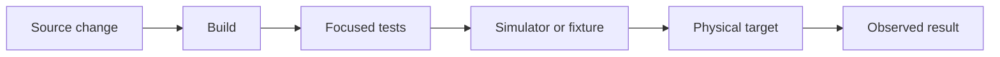
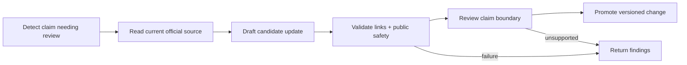
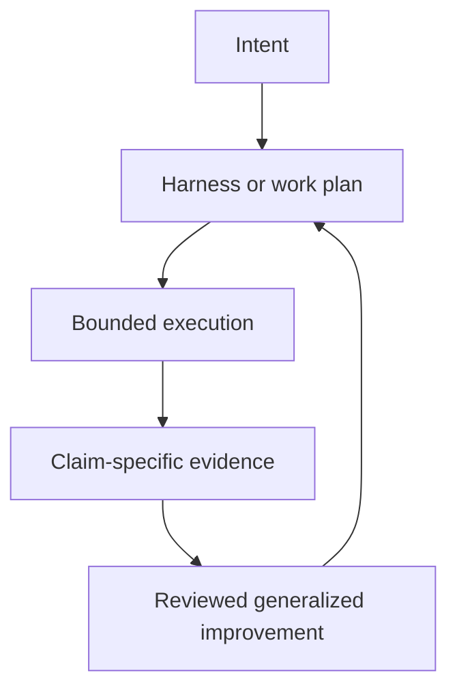

# Example Work Patterns

The examples on this page are synthetic. Their names, systems, paths, and evidence are fictional and do not describe a specific person, repository, organization, or environment.

## Contributor-Ready Application

A small application depends on services that contributors cannot access. The useful mission is not simply to improve its README. It is to create a safe local path that makes the project understandable and testable without private infrastructure.

Useful outcomes might include:

- fixture or demonstration data,
- a documented local run path,
- a single verification command,
- server-side secret handling,
- and a clear distinction between demonstration and production behavior.

## Reusable Workflow Library

A team repeats the same repository review and documentation workflow. Instead of preserving raw prompts or session logs, the reusable parts become a small skill, checklist, or validator.

The public artifact should contain only the generalized workflow. It should not contain the originating repository, internal instructions, tool inventory, paths, configuration, or private examples.

## Layered System Diagnosis

A service reports a visible failure, but the cause could be access, runtime, integration, configuration, data, or presentation.

The safe pattern is:

1. start read-only,
2. identify evidence that distinguishes the layers,
3. gather the least-sensitive evidence first,
4. make the smallest reversible change,
5. read the affected surface back.

## Device Workflow

An application communicates with an external device. A plausible source change is not enough to prove that the workflow works.

Verification may need to cross several surfaces:

The final claim should state exactly which surfaces were checked and which remain unverified.

## Parallel Workstreams

A broad review contains independent research, implementation, and verification questions. Parallel work is useful only when the lanes have non-overlapping ownership and a clear integration point.

Each lane should define:

- its source of truth,
- allowed writes,
- expected output,
- evidence,
- stop condition,
- and parent handoff.

## Compounding Documentation Maintenance

A synthetic documentation system tracks fast-changing product claims. Its first useful harness defines required source classes, public-safety checks, output files, and a publication gate.

The orchestration graph is deliberately small:

The shared vocabulary distinguishes `observed behavior`, `official claim`, `inference`, `unknown`, and `verified date`. After several runs reveal that redirects are being mistaken for stable canonical URLs, the failure becomes a regression case.

A candidate harness change adds canonical-URL resolution and provenance output. The candidate runs against the prior suite plus the new case. It is promoted only if link validation improves without weakening the public-safety or claim-boundary checks. The previous harness version remains available for rollback.

This is compounding because evidence from one run changes later behavior through a versioned and reviewable path. The example remains synthetic: no real task IDs, traces, accounts, paths, connected systems, or private configuration are preserved.

## Common Shape

The reusable pattern is the decision structure, not private detail from the work that produced it.
