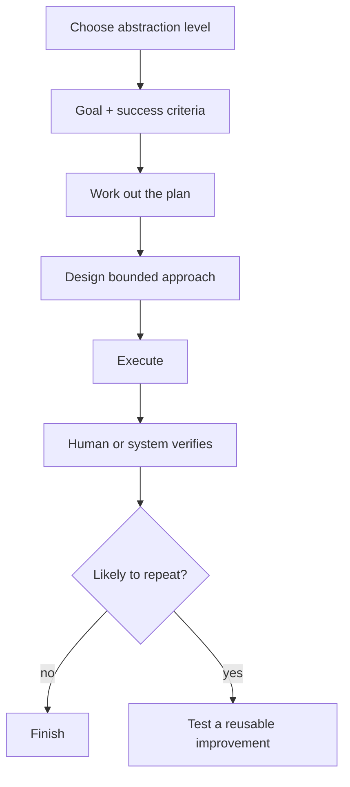
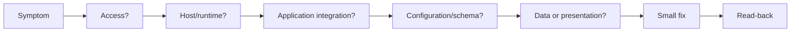
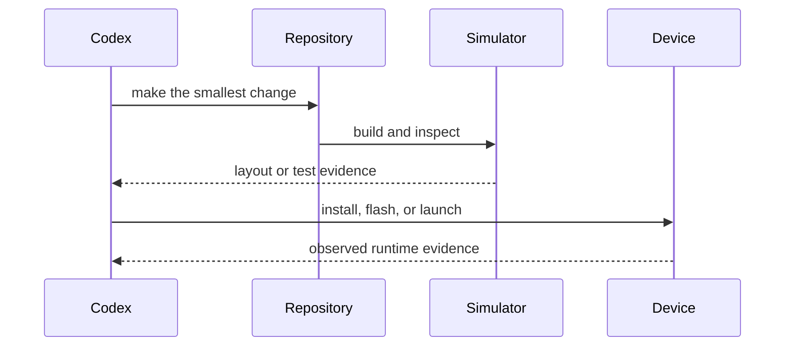

# Field Patterns

These generalized patterns recur across software, operations, devices, documentation, research, and non-code work.

The examples are synthetic and do not describe a specific person, repository, organization, or environment.

The central pattern is choosing the right abstraction level, then checking the real result. As models become more capable, a well-bounded goal can delegate more of the path while the operator retains responsibility for scope, permissions, and verification.

The improvement branch is optional. A one-off task can finish after honest verification. Repeated work is where instructions, skills, scripts, evals, and other reusable pieces start to pay off.

## Live Systems: Read First, Then Touch Things

A reliable operations loop is deliberately conservative:

1. prove which layer is failing,
2. avoid unrelated changes,
3. make the smallest reversible move,
4. read the system back afterward.

The pattern applies to deployed applications, local services, containers, devices, and other layered systems. Actual infrastructure details do not belong in a public example.

## Product Repositories: Provide A Safe Trial Path

A contributor-ready repository should have a way to run without private infrastructure.

That often means:

- fixture or demonstration data,
- a local run path,
- one clear verification command,
- secrets that remain outside the client and repository,
- and documentation that explains the happy path before the architecture tour.

When a workflow repeats, preserve the generalized method as a skill, checklist, template, or validator. Do not preserve the private source material that produced it.

## Parallel Work: Shape Before Swarm

Parallel work becomes useful when each stream has a clear job and handoff, not merely when more agents are running.

The durable pattern is:

- choose the work shape,
- split by ownership boundary,
- give every stream a simple update format,
- keep the parent responsible for integration,
- verify each result before treating it as progress.

The useful part is not the number of agents. It is the shape of the handoffs.

## Devices: The Real Target Gets A Vote

Device work is a useful antidote to agent overconfidence.

If software communicates with a phone, peripheral, display, or board, then "the code looks right" is not enough. Verification may need to reach the actual target:

The final report should distinguish source inspection, build evidence, simulation, and physical-device behavior.

## Non-Code Work Counts

The same operating loop can support:

- shaping messy notes,
- comparing options,
- drafting an update,
- turning a vague idea into a concrete task,
- checking whether a decision is supported by evidence.

Name the outcome, load only the necessary context, do the work, and check the result.

## The Pattern Underneath

Strong Codex workflows usually combine:

- an appropriate abstraction level,
- a clear task shape,
- narrow authoritative context,
- bounded tool access,
- claim-specific checks,
- reusable generalized learning.

When those pieces are missing, fluent output can be mistaken for verified progress.
