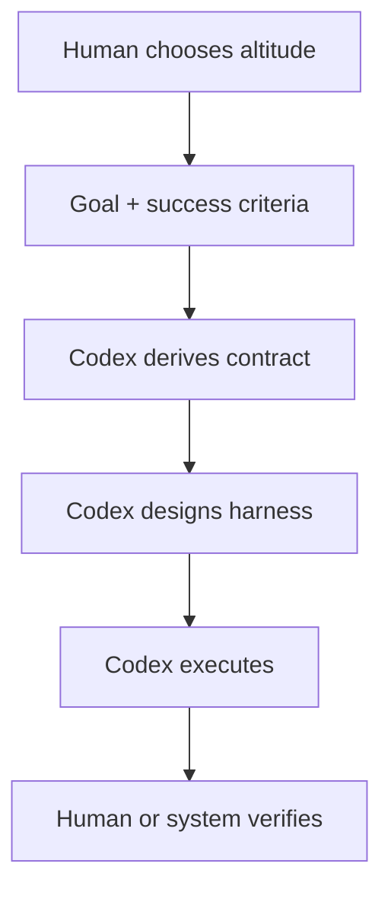
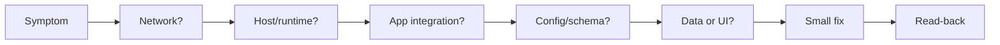
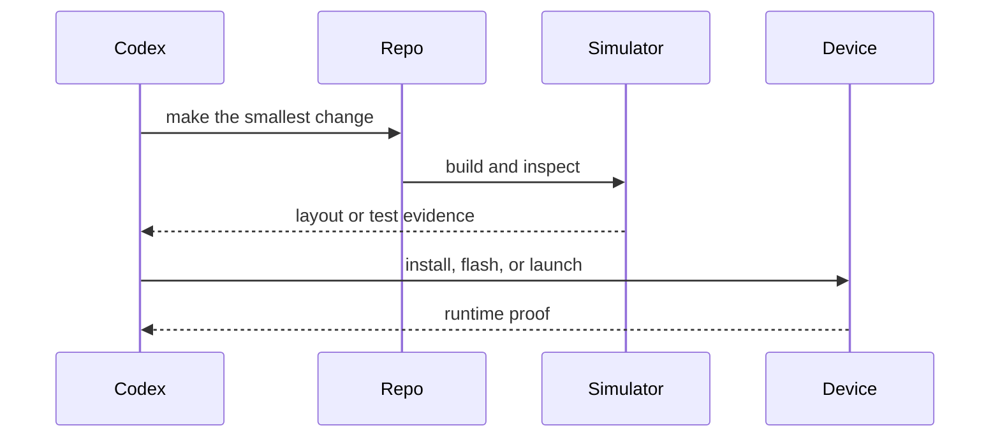

# Field Notes

These are the patterns that keep showing up when I use Codex on actual work instead of toy prompts.

The examples are generalized, but the shape is real: product repos, live systems, hardware, docs, research, and work that is not code at all.

The biggest pattern is altitude. The more capable the model, the less I need to drive every step myself. I can give Codex a goal, success criteria, constraints, and context, then let it derive the project harness and delivery path.

## Live Systems: Read First, Then Touch Things

The most useful Codex loop for ops work is boring in the best way:

1. prove which layer is failing,
2. avoid making random changes,
3. make the smallest reversible move,
4. read the system back after.

This works for homelab stuff, production-ish apps, local containers, routers, media services, and all the little systems that lie to you in slightly different ways.

## Product Repos: Give People A Way To Play

The best Codex-shaped product repos have a way to run without private infrastructure.

That usually means:

- fixture mode,
- fake data,
- a local demo path,
- a single verification command,
- secrets that never leave the backend,
- and docs that explain the happy path before the architecture tour.

[Moodarr](https://github.com/jremick/moodarr) is the cleanest example of this pattern right now.

AI Workbench and AI Skills Share are the higher-altitude version of the same instinct: once useful workflows repeat, turn them into skills, harnesses, registries, and installation paths instead of treating them as one-off prompts.

## Hardware: The Board Gets A Vote

Firmware and device work is a useful antidote to agent overconfidence.

If the app talks to a phone, a BLE device, a display, or a board, then "the code looks right" is not enough. The loop has to reach the actual thing:

[DragyDash](https://github.com/jremick/dragy-dash) and [DragyDash ESP32](https://github.com/jremick/dragy-dash-esp32) are both examples of that loop.

## Non-Code Work Counts

Codex is also useful for things like:

- shaping messy notes,
- comparing options,
- planning a trip,
- writing a better update,
- turning a vague idea into a concrete task,
- checking whether a decision is actually supported by evidence.

The same rules apply. Name the outcome, load the right context, do the work, check the result.

## The Pattern Underneath

Most Codex wins look like this:

- right thinking altitude,
- better task shape,
- narrower context,
- real tool access,
- deterministic checks,
- reusable learning.

When those pieces are missing, Codex is still impressive, but it is much more likely to produce confident sludge.
