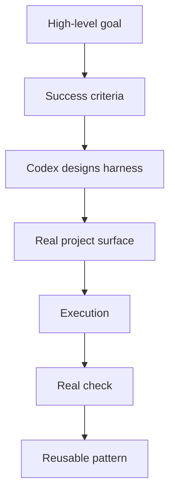

# Related Projects

Codexmaxxing is the field guide. These are some of the nearby projects where the patterns show up in real work.

## AI Workbench

[AI Workbench](https://github.com/jremick/ai-workbench) is the sibling project for reusable AI artifacts: skills, harnesses, memory patterns, context tools, and other bits that make agents easier to steer.

The relationship is simple:

- Codexmaxxing explains the operating patterns.
- [AI Workbench](https://github.com/jremick/ai-workbench) packages some of the reusable tools.

Why it belongs here:

- it is where the reusable side of Codexmaxxing lives,
- it turns repeated workflows into skills and harnesses,
- it is a good example of moving from "I prompted well once" to "I built a reusable operating layer."

## MySkills

[MySkills](https://github.com/jremick/myskills) is a registry/product surface for publishing, reviewing, discovering, installing, and using AI agent skills across web, API, CLI, and MCP interfaces.

Why it belongs here:

- it treats skills as shareable infrastructure,
- it connects the human web surface with agent-facing APIs and MCP,
- it is a natural next step after building useful personal skills and wanting a better way to distribute them.

## Moodarr

[Moodarr](https://github.com/jremick/moodarr) is an open-source Plex + Seerr companion app for natural-language media discovery.

Why it belongs here:

- fixture mode means contributors can run it without a private media setup,
- request creation is intentionally confirmation-gated,
- secrets stay server-side,
- release checks include packaging and container smoke tests,
- the app is a good example of Codex helping shape a real product surface instead of just writing isolated code.

## DragyDash

[DragyDash](https://github.com/jremick/dragy-dash) is an experimental iOS dashboard for live Dragy Pro GNSS telemetry over Bluetooth LE.

Why it belongs here:

- Codex had to work across app code, BLE notes, simulator UI, physical-device install, and safety/privacy cleanup,
- the useful loop was not just "edit Swift",
- the real proof involved tests, simulator inspection, and phone/device behavior.

## DragyDash ESP32

[DragyDash ESP32](https://github.com/jremick/dragy-dash-esp32) is firmware for showing Dragy Pro speed and GPS quality on a LilyGO T-Display-S3.

Why it belongs here:

- firmware makes verification brutally concrete,
- flashing, serial output, display behavior, and BLE runtime state all matter,
- it is a good reminder that an agent saying "this should work" is not the same as a board showing live data.

## What These Have In Common

The pattern is portable: pick a real workflow, define success, give Codex the actual surface, verify the outcome, then save the bit that will help next time.
