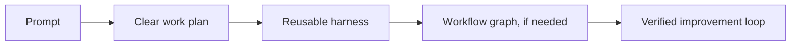
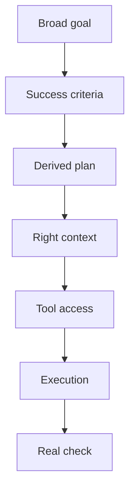

# Research Notes

This is the source-backed side of Codexmaxxing: what the current docs and agent research seem to agree on.

Official product sources on this page were last checked on 2026-08-20.

Short version: the good stuff happens when you stop treating the model as a magic brain and start giving it a decent operating environment.

One important shift is thinking in terms of abstraction level. Capable models can often take a broad goal with clear success criteria and work out the plan and checks. When the work repeats, the stable parts can move into reusable instructions, tools, workflows, and evals. That changes where human judgment is most valuable.

## Sources Worth Reading

Official OpenAI/Codex docs:

- [Current documentation index](https://learn.chatgpt.com/docs/llms.txt)
- [Projects and chats](https://learn.chatgpt.com/docs/projects)
- [Local, Worktree, and Cloud modes](https://learn.chatgpt.com/docs/environments/modes)
- [Goals and long-running work](https://learn.chatgpt.com/docs/long-running-work)
- [Scheduled tasks](https://learn.chatgpt.com/docs/automations)
- [Skills and plugins](https://learn.chatgpt.com/docs/skills-and-plugins)
- [MCP](https://learn.chatgpt.com/docs/extend/mcp)
- [Subagents](https://learn.chatgpt.com/docs/agent-configuration/subagents)
- [Browser](https://learn.chatgpt.com/docs/browser) and [Computer Use](https://learn.chatgpt.com/docs/computer-use)
- [Artifacts](https://learn.chatgpt.com/docs/artifacts-viewer), [Sites](https://learn.chatgpt.com/docs/sites), and [Visualizations](https://learn.chatgpt.com/docs/visualizations)
- [Models](https://learn.chatgpt.com/docs/models)
- [Permissions](https://learn.chatgpt.com/docs/permission-modes), [Rules](https://learn.chatgpt.com/docs/agent-configuration/rules), and [Hooks](https://learn.chatgpt.com/docs/hooks)
- [AGENTS.md](https://learn.chatgpt.com/docs/agent-configuration/agents-md)
- [OpenAI Cookbook agent improvement loop](https://developers.openai.com/cookbook/examples/agents_sdk/agent_improvement_loop)
- [OpenAI: Harness engineering](https://openai.com/index/harness-engineering/)
- [OpenAI: Trustworthy third-party evaluations](https://openai.com/index/trustworthy-third-party-evaluations-foundations/)

Broader agent/workflow references:

- [Anthropic: Building effective agents](https://www.anthropic.com/engineering/building-effective-agents)
- [METR: Measuring AI ability to complete long tasks](https://metr.org/blog/2025-03-19-measuring-ai-ability-to-complete-long-tasks/)
- [SWE-bench Verified](https://www.swebench.com/)

## What The Sources Suggest

### The Human Moves Up A Level

The useful human contribution is shifting upward:

- less manual decomposition of every tiny task,
- more clarity on goals, constraints, taste, and success criteria,
- more attention to context, tools, safety, and verification,
- more reuse of skills, tools, checks, and working patterns.

That does not mean vague prompts work. It means high-level goals work when the success criteria and operating boundaries are clear.

### Codex Is A Workbench

Codex is not just a box that answers questions. The current product includes projects and tasks, goals and schedules, Local/Worktree/Cloud environments, skills and plugins, MCP connectors, Browser and Computer Use, artifacts and hosted Sites, permissions, hooks, rules, models, reasoning controls, and subagents.

That means the leverage is in the setup around the model: the repo, the tools, the docs, the task shape, and the checks.

### Context Is A Design Problem

More context is not automatically better. Useful context is the stuff that changes the decision.

The common failure mode is feeding the agent a giant pile of "maybe relevant" information and then acting surprised when it grabs the wrong piece. Better context design says what is authoritative, what is volatile, what is background, and what should be ignored.

### Tools Are Where Things Get Real

Plugins, MCP, Browser, Computer Use, and other connectors let Codex inspect sources and interact with real systems.

That is where the fun starts. It is also where bad assumptions become more expensive, so the tool story needs read-only exploration, write boundaries, and read-back.

### Verification Is The Multiplier

The agent improvement loop in the OpenAI Cookbook is basically the grown-up version of what works day to day: traces, evals, checks, and iteration.

In normal work, that means tests, screenshots, builds, link checks, API read-backs, simulator runs, device launches, and whatever else proves the task instead of narrating it.

### A Harness Is The Setup Around The Model

The OpenAI Cookbook defines the harness around the model as instructions, tools, routing, output requirements, and validation. In other words, it is the reusable setup that shapes how the model works—not just the prompt.

The useful progression is:

Codex building blocks can support this architecture, but the workflow graph, shared vocabulary, eval suite, adoption policy, and rollback path remain things the system designer has to provide.

### Compounding Needs A Closed Loop

Traces preserve what happened. Feedback explains what mattered. Evals make expectations reusable. Proposed harness changes can then be implemented and tested before adoption.

The loop has to close. Capturing a lesson is not compounding unless it changes future behavior through a versioned, reviewable, and reversible path. The evaluation claim must also remain bound to the tested model, harness, tools, budget, and environment.

### Subagents Are A Knife, Not A Lifestyle

Subagents are useful when the work genuinely splits: separate files, separate research questions, separate checks, separate roles.

They are not automatically better. Sometimes one focused loop beats a whole little committee.

### Parallel Work Needs A Clear Shape

The same applies one level up. Multiple agents, custom agents, automations, and parallel project tasks only help when the work has a clear shape.

That means:

- each stream has a source of truth,
- write boundaries do not overlap accidentally,
- status comes back in a reusable shape,
- the parent owns integration,
- every stream has a proof path.

Without that, "agent team" is just a more expensive way to make context chaos.

### Simple Systems Win First

The broader agent guidance keeps pointing back to the same thing: start simple, compose small pieces, add complexity only when it earns its keep.

For Codex, that usually means:

That is not glamorous. It just works.

The same simplicity rule applies at the next level. Start with one recurring workflow, one reusable setup, and one valuable regression case. Add a graph or formal vocabulary only when dependencies or shared meanings repeatedly cause failures.
