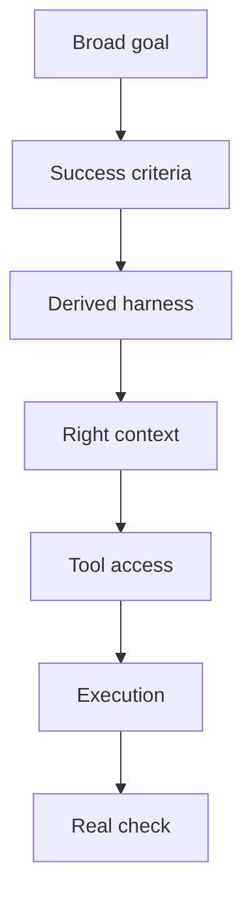

# Research Notes

This is the source-backed side of Codexmaxxing: what the current docs and agent research seem to agree on.

Short version: the good stuff happens when you stop treating the model as a magic brain and start giving it a decent operating environment.

The newer unlock is thinking altitude. Stronger models can often take a broad goal with clear success criteria and derive the task contract, project harness, delivery harness, and checks themselves. That changes what the human needs to be good at.

## Sources Worth Reading

Official OpenAI/Codex docs:

- [OpenAI Codex overview](https://openai.com/codex/)
- [Codex developer docs](https://developers.openai.com/codex/)
- [Codex CLI docs](https://developers.openai.com/codex/cli/)
- [Codex best practices](https://developers.openai.com/codex/learn/best-practices)
- [Codex cloud/web docs](https://developers.openai.com/codex/cloud)
- [Codex app review](https://developers.openai.com/codex/app/review)
- [Codex GitHub integration](https://developers.openai.com/codex/integrations/github)
- [AGENTS.md guide](https://developers.openai.com/codex/guides/agents-md)
- [Codex skills](https://developers.openai.com/codex/skills/)
- [Codex MCP docs](https://developers.openai.com/codex/mcp/)
- [Codex subagents](https://developers.openai.com/codex/subagents/)
- [Codex automations](https://developers.openai.com/codex/automations/)
- [Codex use cases](https://developers.openai.com/codex/use-cases)
- [OpenAI Cookbook agent improvement loop](https://cookbook.openai.com/examples/agents_sdk/agent_improvement_loop)

Broader agent/workflow references:

- [Anthropic: Building effective agents](https://www.anthropic.com/engineering/building-effective-agents)
- [METR: Measuring AI ability to complete long tasks](https://metr.org/blog/2025-03-19-measuring-ai-ability-to-complete-long-tasks/)
- [SWE-bench Verified](https://www.swebench.com/)

## What I Take From It

### The Human Moves Up A Level

The useful human contribution is shifting upward:

- less manual decomposition of every tiny task,
- more clarity on goals, constraints, taste, and success criteria,
- more attention to context, tools, safety, and verification,
- more reuse of skills, harnesses, and operating patterns.

That does not mean vague prompts work. It means high-level goals work when the success criteria and operating boundaries are clear.

### Codex Is A Work Surface

Codex is not just a box that answers questions. The current product surface spans local CLI work, cloud/web work, GitHub integration, code review, MCP tools, skills, automations, project instructions, and subagents.

That means the leverage is in the setup around the model: the repo, the tools, the docs, the task shape, and the checks.

### Context Is A Design Problem

More context is not automatically better. Useful context is the stuff that changes the decision.

The common failure mode is feeding the agent a giant pile of "maybe relevant" information and then acting surprised when it grabs the wrong piece. Better context design says what is authoritative, what is volatile, what is background, and what should be ignored.

### Tools Are Where Things Get Real

MCP and connectors let Codex do real work: inspect repos, read docs, open browsers, call APIs, use GitHub, query databases, and interact with systems.

That is where the fun starts. It is also where bad assumptions become more expensive, so the tool story needs read-only exploration, write boundaries, and read-back.

### Verification Is The Multiplier

The agent improvement loop in the OpenAI Cookbook is basically the grown-up version of what works day to day: traces, evals, checks, and iteration.

In normal work, that means tests, screenshots, builds, link checks, API read-backs, simulator runs, device launches, and whatever else proves the task instead of narrating it.

### Subagents Are A Knife, Not A Lifestyle

Subagents are useful when the work genuinely splits: separate files, separate research questions, separate verification surface, separate role.

They are not automatically better. Sometimes one focused loop beats a whole little committee.

### Simple Systems Win First

The broader agent guidance keeps pointing back to the same thing: start simple, compose small pieces, add complexity only when it earns its keep.

For Codex, that usually means:

That is not glamorous. It just works.
