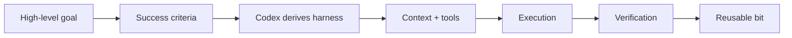

# Example Missions

Codexmaxxing makes more sense when it is attached to a real mission.

The point is not to pre-chew every task. Give Codex altitude, success criteria, and the right context. Let it design the plan underneath.

## 0. Broad Goal: Let Codex Build The Harness

```markdown
Goal:
Turn this rough repo into a public-facing project that people can understand, explore, and reuse.

Success criteria:
- the README has a clear point of view,
- the first-click paths are obvious,
- examples include technical and non-technical work,
- related repos are linked,
- internal maintenance notes are not part of the public surface,
- validation still passes.

Constraints:
- keep the voice casual, practical, and technical,
- avoid work-presentation energy,
- keep private details out.

Context:
Start with README, docs, guides, resources, examples, and the related repos.

Before editing, choose the right thinking altitude and derive the task contract, delivery harness, verification plan, and stop conditions.
```

Good for: repo shaping, product positioning, docs overhaul, public launch prep.

## 1. Product Repo: Make It Runnable

```markdown
This repo is nearly useful, but I want someone else to be able to run it without my private setup.

Review the README, env examples, scripts, tests, and demo/fixture path.
Find the smallest set of changes that would make the repo contributor-friendly.
Do not assume access to private services.
Verify with the repo's normal checks.
```

Good for: app repos, CLI tools, open-source cleanup, public project polish.

## 2. Live Issue: Stop Guessing

```markdown
Something is broken:
<symptom>

Start read-only. Separate possible causes by layer:
- network/access
- host/runtime
- app integration
- config/schema
- auth
- data
- UI/presentation

Tell me what evidence would distinguish them, then gather the safe evidence first.
```

Good for: homelab ops, deployed apps, integrations, "it worked yesterday" problems.

## 3. Hardware Loop: The Device Decides

```markdown
Make this hardware/UI change, but do not stop at code.

Expected result:
<observable behavior>

Verification path:
1. build
2. run focused tests if available
3. inspect simulator or mock UI if relevant
4. flash/install/launch on the real target
5. report exactly what was proven
```

Good for: iOS, firmware, BLE, devices, dashboards, anything where the real target has opinions.

## 4. Non-Code Work: Make The Mess Useful

```markdown
I have messy notes and a rough goal:
<paste notes>

Turn this into:
- the real point
- the decision or output needed
- missing context
- a suggested structure
- a draft/check loop
- what should stay human judgment
```

Good for: writing, research, trip planning, comparison shopping, strategy notes, meeting follow-up.

## 5. Parallel Portfolio: Keep Multiple Threads Moving

```markdown
I have these active projects:
- <project 1>
- <project 2>
- <project 3>

Goal:
Keep useful progress moving without mixing context, losing blockers, or over-delegating.

Success criteria:
- each project has a current state,
- the next useful action is visible,
- parallelizable work is separated from serial work,
- every delegated stream has a proof path,
- the parent thread has clear integration checkpoints.

Design the agentic harness topology first. Then recommend which work should stay with the parent, which should go to subagents or custom agents, and what status contract each stream should use.
```

Good for: side-project portfolios, multi-repo cleanup, launch prep, research plus implementation, and "I have five things open and somehow none of them are done."

## The Common Shape



The domain changes. The loop mostly does not.
