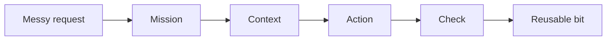

# Example Missions

Codexmaxxing makes more sense when it is attached to a real mission. These are example shapes I would actually hand to Codex.

## 1. Product Repo: Make It Runnable

```markdown
This repo is nearly useful, but I want someone else to be able to run it without my private setup.

Review the README, env examples, scripts, tests, and demo/fixture path.
Find the smallest set of changes that would make the repo contributor-friendly.
Do not assume access to private services.
Verify with the repo's normal checks.
```

Good for: app repos, CLI tools, open-source cleanup, public project polish.

## 2. Live Issue: Stop Guessing

```markdown
Something is broken:
<symptom>

Start read-only. Separate possible causes by layer:
- network/access
- host/runtime
- app integration
- config/schema
- auth
- data
- UI/presentation

Tell me what evidence would distinguish them, then gather the safe evidence first.
```

Good for: homelab ops, deployed apps, integrations, "it worked yesterday" problems.

## 3. Hardware Loop: The Device Decides

```markdown
Make this hardware/UI change, but do not stop at code.

Expected result:
<observable behavior>

Verification path:
1. build
2. run focused tests if available
3. inspect simulator or mock UI if relevant
4. flash/install/launch on the real target
5. report exactly what was proven
```

Good for: iOS, firmware, BLE, devices, dashboards, anything where the real target has opinions.

## 4. Non-Code Work: Make The Mess Useful

```markdown
I have messy notes and a rough goal:
<paste notes>

Turn this into:
- the real point
- the decision or output needed
- missing context
- a suggested structure
- a draft/check loop
- what should stay human judgment
```

Good for: writing, research, trip planning, comparison shopping, strategy notes, meeting follow-up.

## The Common Shape



The domain changes. The loop mostly does not.
