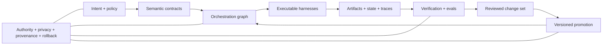

# From Prompts To Compounding Systems

A prompt can describe a task. A durable Codex environment can embody how a class of tasks is understood, executed, checked, and improved.

The important transition is not simply from short prompts to long prompts, or from tasks to goals. It is from putting the operating method inside each prompt to engineering that method into inspectable, reusable system layers.

> A prompt should increasingly become an initialization boundary for an already engineered system, not the place where the whole system is described.

## One Ladder Is Not Enough

Agentic maturity has at least three independent dimensions:

| Dimension | Governing question | Progression |
| --- | --- | --- |
| Intent abstraction | How much implementation does the operator specify? | exact edit → framed task → outcome → system objective |
| System embodiment | Where does the operating method live? | prompt → template or skill → harness → orchestration graph → semantic system |
| Improvement closure | How does future performance improve? | ad hoc learning → captured lesson → trace and eval → reviewed change → gated self-improvement |

A high-level prompt does not prove that a mature system exists. It can still launch an opaque, disposable run. A mature system can accept a short prompt because its definitions, tools, state, checks, and authority boundaries already exist.

## The Maturity Progression

| Stage | Unit Being Engineered | What Persists | Verification Target |
| --- | --- | --- | --- |
| Instruction | one model action | little or nothing | requested output |
| Task contract | one bounded result | outcome, constraints, and proof path | task completion |
| Mission | a derived body of work | plan, context map, and delivery state | mission success criteria |
| Harness | a repeatable execution contract | instructions, tools, routing, outputs, and checks | repeatable behavior |
| Orchestration system | a graph of harnesses and state transitions | dependencies, ownership, state, and recovery paths | system invariants and end-to-end flow |
| Compounding system | a governed improvement loop | traces, evals, versioned changes, and promotion history | better future performance without regression |

Higher maturity does not mean maximum autonomy. It means that more behavior is explicit, reusable, observable, and enforceable. Authority can remain narrow at every stage.

## The Compounding Architecture

The model is only one component. The surrounding system determines what the model can see, which actions are possible, how intermediate state is represented, what counts as success, and whether a lesson changes future behavior.

## What Compounding Means

A workflow compounds only when useful improvements survive the run and improve later work.

Evidence of compounding includes:

- runs produce structured, privacy-safe evidence;
- feedback is linked to a particular behavior or system decision;
- recurring failures become regression checks or evals;
- proposed changes are versioned and attributable;
- candidate and promoted versions face comparable checks;
- promotion and rollback boundaries are explicit;
- successful improvements are reusable without repasting them into prompts;
- private incidents are generalized before becoming shared guidance.

Repeated automation without these properties may still be valuable, but it is not yet a compounding system.

## Build Depth-First

Do not begin with a universal graph, a large ontology, or an autonomous optimizer.

Start with one recurring workflow:

1. Make its outcome and evidence explicit.
2. Capture the smallest repeatable harness.
3. Represent only the dependencies and state transitions that affect correctness.
4. Add an eval for one recurring or costly failure.
5. Require a reviewed, reversible change before promotion.
6. Expand only when another workflow can reuse the same contracts.

The useful system is the smallest one that makes the next run more reliable. Complexity that does not improve legibility, verification, recovery, or reuse is coordination debt.

## Product Boundary

Codex provides building blocks such as project instructions, skills, tools, hooks, subagents, chats, goals, and execution environments. A graph-oriented harness, ontology-driven workflow, or compounding improvement system is an architecture built with and around those primitives. It is not a single built-in Codex object.

Current OpenAI material supports the broader direction: skills package repeatable workflows, hooks run deterministic lifecycle scripts, subagents support bounded parallel work, and the agent improvement loop turns traces, feedback, evals, and reviewed harness changes into a reusable flywheel. OpenAI's harness-engineering account also emphasizes legible environments, enforceable invariants, feedback loops, and repository-local systems of record.

## Sources

Checked on 2026-08-20 against [Harness engineering](https://openai.com/index/harness-engineering/), [Agent improvement loop](https://developers.openai.com/cookbook/examples/agents_sdk/agent_improvement_loop), [Skills and plugins](https://learn.chatgpt.com/docs/skills-and-plugins), [Hooks](https://learn.chatgpt.com/docs/hooks), and [Subagents](https://learn.chatgpt.com/docs/agent-configuration/subagents).
