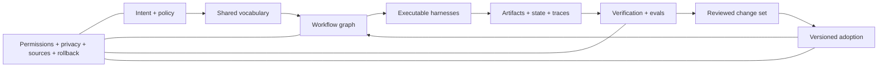

# From Prompts To Compounding Systems

A good prompt can get one job done. A good Codex setup can make a whole class of jobs easier to run, check, and improve.

The shift is not from short prompts to long prompts, or even from tasks to goals. It is from explaining the method again in every prompt to putting the reusable parts into instructions, tools, workflows, and checks that Codex can find when it needs them.

> The prompt should start the system, not explain the whole system again.

## Three Questions

Moving to a higher-level request is only one part of the picture:

| Dimension | Governing question | Progression |
| --- | --- | --- |
| What are you asking Codex to own? | How much of the implementation path is already specified? | exact edit → framed task → outcome → system objective |
| Where does the method live? | Is the method trapped in this prompt or reusable later? | prompt → template or skill → harness → workflow graph and shared schema |
| Does the learning improve the next run? | What happens when evidence shows a better way? | ad hoc lesson → captured check → evaluated change → reviewed adoption |

A high-level prompt can still launch an opaque, disposable run. A mature system can accept a short prompt because its definitions, tools, state, checks, and permission boundaries already exist.

## The Maturity Progression

| Stage | What You Are Building | What Persists | What You Check |
| --- | --- | --- | --- |
| Instruction | one model action | little or nothing | requested output |
| Bounded task | one result | outcome, constraints, and proof path | task completion |
| Mission | a body of work derived from a goal | plan, useful context, and delivery state | mission success criteria |
| Harness | the setup around a repeatable capability | instructions, tools, routing, outputs, and checks | repeatable behavior |
| Orchestration system | connected workflows and state changes | dependencies, ownership, state, and recovery paths | rules that must hold and the end-to-end flow |
| Compounding system | a controlled improvement loop | evidence, evals, versioned changes, and adoption history | better future performance without regression |

Higher maturity does not mean maximum autonomy. It means that more behavior is explicit, reusable, observable, and enforceable. Permissions can remain narrow at every stage.

## What The Full System Can Look Like

The model is only one part. The surrounding setup determines what it can see and change, how work moves, what counts as success, and whether a useful lesson changes later runs.

## What Compounding Means

A workflow compounds only when useful improvements survive the run and improve later work.

Evidence of compounding includes:

- runs produce structured, privacy-safe evidence;
- feedback is linked to a particular behavior or system decision;
- recurring failures become regression checks or evals;
- proposed changes are versioned and attributable;
- the proposed and current versions face comparable checks;
- adoption and rollback boundaries are explicit;
- successful improvements are reusable without repasting them into prompts;
- private incidents are generalized before becoming shared guidance.

Repeated automation without these properties may still be valuable, but it is not yet a compounding system.

## Build Depth-First

Do not begin with a universal graph, a large ontology, or an autonomous optimizer. Most workflows need none of those.

Start with one recurring workflow:

1. Make its outcome and evidence explicit.
2. Capture the smallest repeatable workflow.
3. Represent only the dependencies and state transitions that affect correctness.
4. Add an eval for one recurring or costly failure.
5. Require a reviewed, reversible change before adopting it.
6. Expand only when another workflow can reuse the same pieces.

The useful system is the smallest one that makes the next run more reliable. Complexity that does not make the workflow easier to understand, check, recover, or reuse is coordination debt.

## Product Boundary

Codex provides building blocks such as project instructions, skills, tools, hooks, subagents, chats, goals, and execution environments. A graph-oriented harness, ontology-driven workflow, or compounding improvement system is an architecture built with and around those primitives. It is not a single built-in Codex object.

Current OpenAI material supports the broader direction: skills package repeatable workflows, hooks run deterministic lifecycle scripts, subagents support bounded parallel work, and the agent improvement loop connects traces, feedback, evals, and reviewed harness changes. OpenAI's harness-engineering account also emphasizes understandable environments, enforceable rules, feedback loops, and repository-local sources of truth.

## Sources

Checked on 2026-08-20 against [Harness engineering](https://openai.com/index/harness-engineering/), [Agent improvement loop](https://developers.openai.com/cookbook/examples/agents_sdk/agent_improvement_loop), [Skills and plugins](https://learn.chatgpt.com/docs/skills-and-plugins), [Hooks](https://learn.chatgpt.com/docs/hooks), and [Subagents](https://learn.chatgpt.com/docs/agent-configuration/subagents).
