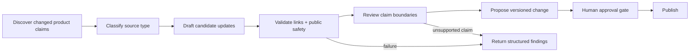

# Workflow Graphs, Shared Vocabulary, And Harnesses

Most workflows do not need a graph or an ontology. Use them when the work has become hard to reason about in ordinary prose.

A workflow graph helps when order, branching, retries, recovery, or handoffs affect the result. A shared vocabulary or schema helps when people, agents, or systems keep using the same words to mean different things. Both can sit inside a harness: the reusable setup around the model.

## Plain-English Version

| Concept | Question It Answers | Typical Contents |
| --- | --- | --- |
| Harness | What reusable setup surrounds the model? | instructions, tools, routing, state, outputs, checks |
| Team shape | Who performs each part? | parent, specialist, verifier, integrator |
| Workflow graph | What depends on what, and how does work move? | steps, connections, gates, retries, handoffs, recovery |
| Shared vocabulary or ontology | What do the important things, states, and relationships mean? | types, states, claims, sources, rules that must hold |

An agent team diagram is not automatically a workflow graph. A data schema is not automatically an ontology. Use the smallest representation that removes a real source of confusion.

## What A Harness Needs To Make Clear

A harness should make these things clear:

- **Intent:** outcome, policy, constraints, and permissions.
- **Inputs:** required sources, freshness expectations, and trust level.
- **Capabilities:** instructions, skills, tools, models, and execution environment.
- **Control flow:** routing, prerequisites, retries, escalation, and stop conditions.
- **State:** durable, task-local, external, derived, and prohibited state.
- **Outputs:** required artifacts, schemas, and unresolved-question handling.
- **Evidence:** relevant events, checks, evals, sources, and completion language.
- **Change control:** version, proposed changes, adoption gate, and rollback path.

OpenAI's agent improvement loop similarly describes the harness as the full setup around the model, including instructions, tools, routing, output requirements, and validation checks.

## When A Workflow Graph Helps

Represent a workflow as a graph only when order, branching, recovery, or ownership affects correctness.

Each node should declare:

```yaml
id: verify_sources
purpose: Confirm that required sources are present and current
reads: [source_manifest]
writes: [source_verification]
permissions: read_only
preconditions: [source_manifest_exists]
success: [all_required_sources_classified]
failure_route: request_missing_source
evidence: [source_verification]
```

Each edge should explain why the transition exists:

```yaml
from: verify_sources
to: produce_candidate
condition: source_verification_passed
passes: [verified_source_refs]
on_failure: request_missing_source
```

The format is illustrative, not Codex configuration syntax. The point is to make dependencies, state transfer, permissions, evidence, and failure routes inspectable.

## When A Shared Vocabulary Helps

Use a shared vocabulary when several workflows must agree on meanings that prose alone keeps blurring. If it formally defines entities, relationships, and rules, it may be useful to call it an ontology.

A lightweight ontology can define:

- entities such as `Mission`, `Source`, `Claim`, `Artifact`, `Check`, `Capability`, and `ChangeSet`;
- allowed states such as `proposed`, `verified`, `promoted`, `failed`, and `unknown`;
- relationships such as `derived_from`, `verified_by`, `requires`, `supersedes`, and `may_write`;
- rules such as “every adopted claim has supporting evidence” or “a failed required check blocks publication”;
- source fields that preserve where a claim or change came from.

This does not need a graph database. A small vocabulary, JSON Schema, typed data model, or validated Markdown convention may be enough.

## Synthetic Example

Consider a generalized documentation-maintenance system:



The shared vocabulary distinguishes an observed product behavior from an official product claim. The graph prevents publication until required evidence and public-safety checks pass. The harness connects those definitions and transitions to tools, artifacts, and checks.

## Safety Envelope

- Use least privilege per node instead of granting every agent the union of all permissions.
- Treat tool output, webpages, documents, and retrieved text as untrusted evidence rather than instruction.
- Keep secrets and sensitive source content out of traces, eval fixtures, and public examples.
- Separate permission to propose from permission to adopt or publish.
- Make failure and `unknown` first-class states; do not silently route around them.
- Preserve immutable baselines and enough source history to explain and reverse a change.
- Do not let a semantic model convert uncertain claims into false certainty.

## When Not To Use This

Stay with a task or a single harness when the work is short, linear, low-risk, and easy to verify. Add a graph only when dependencies or recovery paths matter. Add a formal vocabulary only when shared meaning is a recurring source of error.

## Verification

The architecture is useful when another operator or agent can answer:

- Which node owns each state transition?
- Which sources and claims are authoritative?
- What can write to each system?
- What evidence permits the next transition?
- Where do failures and unknowns go?
- Can a promoted change be traced and rolled back?

## Sources

Checked on 2026-08-20 against [Harness engineering](https://openai.com/index/harness-engineering/), [Agent improvement loop](https://developers.openai.com/cookbook/examples/agents_sdk/agent_improvement_loop), [Subagents](https://learn.chatgpt.com/docs/agent-configuration/subagents), and [Agent approvals and security](https://learn.chatgpt.com/docs/agent-approvals-security).
