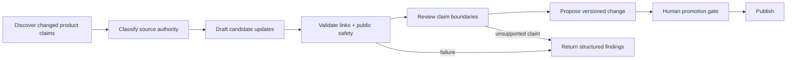

# Graph And Ontology-Engineered Harnesses

A reusable harness needs more than a good prompt. It needs an explicit contract for what exists, how work moves, which state can change, and how results are checked.

Graphs and ontologies make different parts of that contract legible.

## Four Different Things

| Concept | Question It Answers | Typical Contents |
| --- | --- | --- |
| Harness | What surrounds the model for this repeatable capability? | instructions, tools, routing, state, outputs, validation |
| Agent topology | Who performs the work? | parent, specialist, verifier, integrator |
| Orchestration graph | What depends on what, and how does execution move? | nodes, edges, gates, retries, handoffs, recovery |
| Ontology | What do the system's entities and relationships mean? | types, states, claims, provenance, invariants |

An agent team diagram is not automatically an orchestration graph. A data schema is not automatically an ontology. Use the smallest representation that removes real ambiguity.

## Harness Contract

A harness should make these surfaces explicit:

- **Intent:** outcome, policy, constraints, and authority.
- **Inputs:** required sources, freshness expectations, and trust level.
- **Capabilities:** instructions, skills, tools, models, and execution environment.
- **Control flow:** routing, prerequisites, retries, escalation, and stop conditions.
- **State:** durable, task-local, external, derived, and prohibited state.
- **Outputs:** required artifacts, schemas, and unresolved-question handling.
- **Evidence:** traces, checks, evals, provenance, and completion language.
- **Change control:** version, proposed changes, promotion gate, and rollback path.

OpenAI's agent improvement loop similarly describes the harness as the full contract around the model, including instructions, tools, routing, output requirements, and validation checks.

## The Orchestration Graph

Represent a workflow as a graph when order, branching, recovery, or ownership affects correctness.

Each node should declare:

```yaml
id: verify_sources
purpose: Confirm that required sources are present and current
reads: [source_manifest]
writes: [source_verification]
authority: read_only
preconditions: [source_manifest_exists]
success: [all_required_sources_classified]
failure_route: request_missing_source
evidence: [source_verification]
```

Each edge should explain why the transition exists:

```yaml
from: verify_sources
to: produce_candidate
condition: source_verification_passed
passes: [verified_source_refs]
on_failure: request_missing_source
```

The format is illustrative, not a Codex configuration syntax. The important property is that dependencies, state transfer, authority, evidence, and failure routing are inspectable.

## The Ontology

Use an ontology when several harnesses must agree on meanings that prose alone keeps blurring.

A lightweight ontology can define:

- entities such as `Mission`, `Source`, `Claim`, `Artifact`, `Check`, `Capability`, and `ChangeSet`;
- allowed states such as `proposed`, `verified`, `promoted`, `failed`, and `unknown`;
- relationships such as `derived_from`, `verified_by`, `requires`, `supersedes`, and `may_write`;
- invariants such as “every promoted claim has supporting evidence” or “a failed required check blocks promotion”;
- provenance fields that preserve where a claim or change came from.

The ontology does not need a graph database. A small vocabulary, JSON Schema, typed data model, or validated Markdown convention may be enough.

## Synthetic Example

Consider a generalized documentation-maintenance system:



The ontology distinguishes an observed product behavior from an official product claim. The graph prevents publication until required evidence and public-safety checks pass. The harness binds those definitions and transitions to tools, artifacts, and checks.

## Safety Envelope

- Use least privilege per node instead of granting every agent the union of all permissions.
- Treat tool output, webpages, documents, and retrieved text as untrusted evidence rather than instruction.
- Keep secrets and sensitive source content out of traces, eval fixtures, and public examples.
- Separate proposal authority from promotion or publication authority.
- Make failure and `unknown` first-class states; do not silently route around them.
- Preserve immutable baselines and enough provenance to explain and reverse a change.
- Do not let a semantic model convert uncertain claims into false certainty.

## When Not To Use This

Stay with a task contract or a single harness when the work is short, linear, low-risk, and easy to verify. Add a graph only when dependencies or recovery paths matter. Add an ontology only when shared meaning is a recurring source of error.

## Verification

The architecture is useful when another operator or agent can answer:

- Which node owns each state transition?
- Which sources and claims are authoritative?
- What can write to each system?
- What evidence permits the next transition?
- Where do failures and unknowns go?
- Can a promoted change be traced and rolled back?

## Sources

Checked on 2026-08-20 against [Harness engineering](https://openai.com/index/harness-engineering/), [Agent improvement loop](https://developers.openai.com/cookbook/examples/agents_sdk/agent_improvement_loop), [Subagents](https://learn.chatgpt.com/docs/agent-configuration/subagents), and [Agent approvals and security](https://learn.chatgpt.com/docs/agent-approvals-security).
