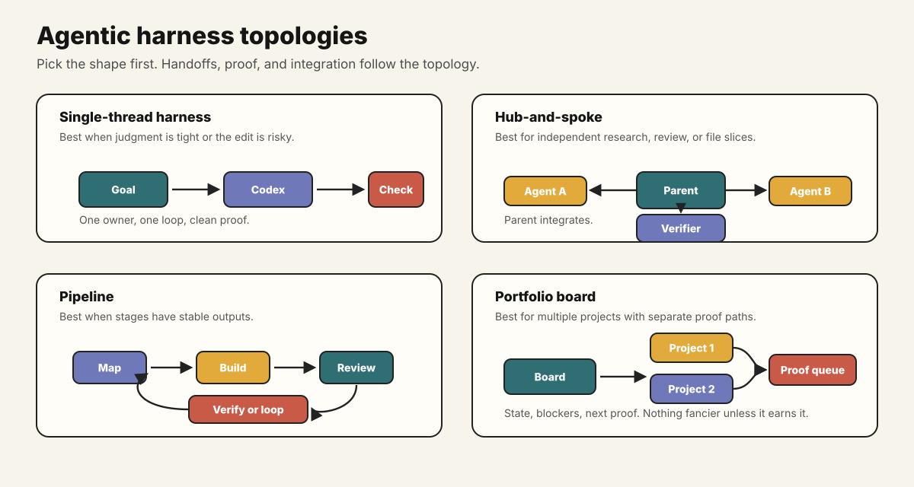

# Parallel Projects And Agent Teams

Once abstraction level is clear, the next challenge is running more than one useful thread without creating coordination noise.

Parallel Codex work is not "spawn as many agents as possible." It is giving each stream a clear goal, source of truth, write boundary, update format, and evidence path.

Choose where the work should run as well as the team shape. Use subagents for independent work inside one objective, worktrees for independent Git writers, and cloud environments for remote isolated execution. See [Local, Worktree, And Cloud Environments](environments-worktrees-and-cloud.md).



## The Simple Rule

Parallelize by ownership boundary, not by enthusiasm.

Good splits:

- one agent maps the repo while another drafts the docs,
- one thread researches current docs while the main thread edits local files,
- one agent implements while another reviews the diff,
- one project has a product pass while another has a release-check pass,
- one custom agent repeatedly handles a known workflow with stable inputs and outputs.

Bad splits:

- two agents editing the same files,
- three agents answering the same vague question,
- one parent waiting on the delegated task that is actually the immediate blocker,
- a swarm with no integration point,
- background work with no clear update format.

## Useful Work Shapes

The shape is simply who owns what, where state lives, how handoffs happen, and where evidence comes back.

| Shape | Use It For | Watch Out For |
| --- | --- | --- |
| Single task | small tasks, risky edits, tight judgment loops | fake speed from premature delegation |
| Hub-and-spoke | broad repo reviews, research plus implementation, multiple independent questions | parent must integrate and verify |
| Pipeline | repeatable delivery flow: discover, implement, review, verify, publish | slow stages if each handoff is vague |
| Portfolio board | multiple projects moving in parallel | stale state and invisible blockers |
| Specialist team | recurring roles like researcher, implementer, verifier, release wrangler | role names are not enough; outputs must be concrete |

The setup can be manual at first. Once it repeats, make it a prompt, template, skill, custom agent, MCP workflow, or automation.

## The Team Is Not The Workflow

The team shape describes who performs the work. A workflow graph also describes:

- prerequisites and transition conditions,
- state passed between nodes,
- allowed reads and writes,
- deterministic and judgment-based gates,
- retry, recovery, escalation, and stop paths,
- evidence required before the next transition.

A hub-and-spoke team can run many different workflows. A single agent can also execute a multi-stage workflow. Use [Workflow Graphs, Shared Vocabulary, And Harnesses](graph-and-ontology-engineered-harnesses.md) when the order and failure routes matter as much as the role split.

## A Simple Update Format

Every parallel stream needs a small update shape. Otherwise you get a pile of summaries and no idea what is actually happening.

```markdown
Mission:
Owner:
Source of truth:
Allowed writes:
Current state:
Blocked on:
What changed or was inspected:
Evidence:
Next handoff:
Stop condition:
```

This is the part that makes parallel work feel less like juggling tabs and more like running one coherent job.

## Automating Delegation

For bigger work, Codex can propose the split before execution instead of requiring every subtask to be designed manually.

```markdown
Goal:
<what should be true>

Success criteria:
<what would prove it worked>

Constraints:
<scope, safety, privacy, style, timing>

Context:
<repositories, documents, tools, live systems, or examples to inspect first>

Before executing:
1. choose the simplest useful work shape,
2. decide what should stay in the parent thread,
3. define any subagents, custom agents, or agent-team roles,
4. give each stream a source of truth, write boundary, update format, and verification path,
5. identify the integration checkpoint.
```

Codex can often propose a useful work breakdown when the goal, boundaries, and integration point are clear.

## Custom Agents And Agent Teams

Custom agents are worth it when the same role keeps showing up.

Useful recurring roles:

- repo cartographer: maps files, commands, risks, and start paths,
- researcher: gathers current sources and separates stable facts from drift-prone facts,
- implementer: owns a bounded file/module slice,
- verifier: runs checks, screenshots, read-backs, or review passes,
- docs/voice agent: keeps public docs clear and on-style,
- release wrangler: checks packaging, changelog, tags, CI, and public-readiness requirements.

An agent team is not automatically smarter than one good loop. It becomes useful when each agent has a clear responsibility and the parent has a clean integration point.

## Running Multiple Projects

For parallel projects, keep a small durable board in an appropriate tracker or structured local file.

Track only what changes decisions:

- mission,
- current state,
- next action,
- owner or active agent,
- blocker,
- proof needed,
- last verified date.

Do not create a large project-management system for a small portfolio. Keep enough state for Codex to resume, delegate, and verify without reconstructing the entire context every time.

## When To Stay Serial

Stay serial when:

- the work is tiny,
- the next move is risky or destructive,
- the source of truth is unclear,
- edits are tightly coupled,
- integration judgment is the hard part,
- you cannot verify the sub-result independently.

Parallel work is only maxxing when it increases verified throughput. If it creates coordination debt, it is just fancy procrastination.

## Verification

Parallel work worked when:

- the parent can explain the current state of every stream,
- each delegated result has evidence,
- integration is cleaner than doing it all in one thread,
- no one wrote across another stream's boundary,
- at least one repeated pattern became easier to run next time.
