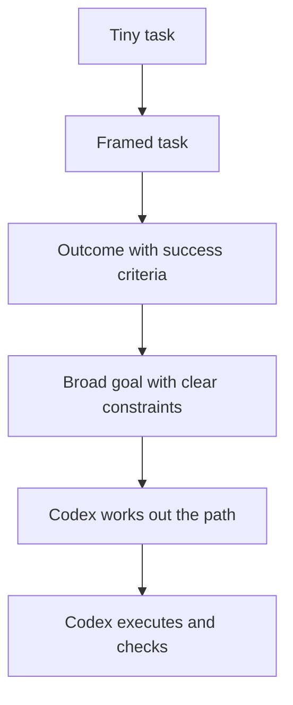

# Thinking Abstraction Level

Abstraction level is one of the most useful choices in agentic work: how much of the path are you giving Codex to work out?

With older or weaker tooling, you had to drive close to the ground: exact prompts, exact steps, exact files, exact plan. That still works, but it leaves a lot of the value on the table.

With stronger frontier models, the better move is often to go up a level:



The human job shifts from writing every step to choosing the right level and making the outcome clear.

## What Abstraction Level Means

Abstraction level describes how close a task statement is to the desired outcome versus an individual implementation action.

Low abstraction level:

```markdown
Change line 42 to use `color_temp_kelvin`.
```

Medium abstraction level:

```markdown
Fix the automation schema issue. Verify the target system accepts the configuration and the previous error stops appearing.
```

Higher abstraction level:

```markdown
The automations broke after an upgrade. Diagnose the likely failure layer, make the smallest safe fix, and verify the affected workflow is healthy again.
```

All three can be right. The useful judgment is knowing when Codex can take the higher-abstraction version and derive the work underneath it.

## Abstraction Is Not The Whole System

Abstraction level describes the request, not the maturity of the system receiving it.

Three separate questions matter:

| Question | What It Means | Progression |
| --- | --- | --- |
| What are you asking Codex to own? | How much of the implementation path is already specified? | edit → task → outcome → system objective |
| Where does the method live? | Is it in this prompt or in reusable instructions, tools, and checks? | prompt → reusable workflow → harness → orchestration system |
| Does the learning improve the next run? | What happens when the workflow finds a better way? | nothing → captured lesson → eval → reviewed change |

A broad prompt sent to a disposable agent is still a one-off run. A short request can start a mature system when the definitions, state, tools, checks, and permission boundaries already exist.

See [From Prompts To Compounding Systems](from-prompts-to-compounding-systems.md) for the complete model.

## The New Default

For bigger work, do not start by writing the whole plan yourself.

Start with:

```markdown
Goal:
<what should be true>

Success criteria:
<what would prove it worked>

Constraints:
<scope, safety, style, time, privacy, compatibility>

Context:
<what matters, or where to look first>
```

Then ask Codex to work out only what the job needs, such as:

- a short plan,
- the sources that matter,
- how the work should be split,
- the verification plan,
- the stop conditions.

For recurring work, those pieces may eventually become a reusable harness. For one-off work, they can stay as a small plan in the task.

## When To Go Higher

Go higher when:

- the goal is clear but the path is not,
- the repo or system has enough context for Codex to inspect,
- success criteria can be stated,
- the work can be verified,
- the downside of a wrong plan is bounded by review or approval.

Stay lower when:

- the next action is risky,
- the target is fragile or destructive,
- the source of truth is not available,
- you already know the exact safe edit,
- ambiguity would cause expensive churn.

## The Abstraction Level Ladder

| Abstraction Level | You Provide | Codex Provides |
| --- | --- | --- |
| Exact edit | File, line, change | The edit and maybe a quick check |
| Framed task | Outcome, source, constraints | The steps and verification |
| Mission | Goal, success criteria, context | Plan, implementation, and checks |
| System objective | Direction, policies, boundaries, rules that must hold | Reusable workflow, coordination, execution, evidence, and proposed improvements |

A higher abstraction level does not mean less clarity. It means clarity moves from steps to outcomes, boundaries, and success criteria.

It also delegates more discretion. As abstraction rises, make scope, permissions, verification, and stop conditions more explicit. A broader goal never grants broader permission by itself.

## The Failure Mode

The bad version of this is vague delegation:

```markdown
Make this better.
```

That is not high abstraction. It is ambiguity.

High-abstraction work still has a shape:

```markdown
Make this repo feel like a public project someone would actually want to explore.

Success criteria:
- the README has a clear point of view,
- the first-click paths are obvious,
- internal maintenance notes are not part of the public surface,
- examples are synthetic and public-safe,
- validation still passes.
```

Codex can turn that into a sensible plan, file edits, and checks.

## Why This Matters

The ceiling moves when the model can reason well enough to design more of the path.

You stop spending all your energy decomposing work into tiny tickets and start spending more of it on:

- choosing better goals,
- defining better success criteria,
- giving better context,
- building better tools,
- keeping verification honest.

That is where Codex starts to feel less like autocomplete and more like a real operating layer for work.

For work that repeats, the next ceiling is not a still-higher prompt. It is an environment where a short request starts a known workflow, evidence can improve later runs, and permission remains explicit throughout.
