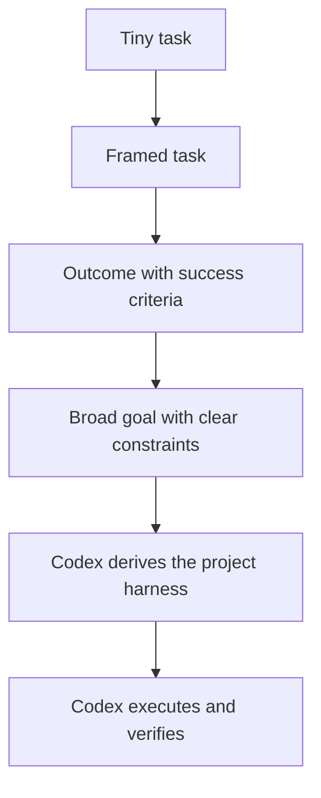

# Thinking Altitude

This is the biggest Codexmaxxing unlock for me.

With older or weaker tooling, you had to drive close to the ground: exact prompts, exact steps, exact files, exact plan. That still works, but it leaves a lot of the value on the table.

With stronger frontier models, the better move is often to go up a level:



The human job shifts from "write every step" to "choose the right altitude."

## What Altitude Means

Thinking altitude is the level you hand the work over at.

Low altitude:

```markdown
Change line 42 to use `color_temp_kelvin`.
```

Medium altitude:

```markdown
Fix the light automation schema issue. Verify Home Assistant accepts the config and the old error stops appearing.
```

Higher altitude:

```markdown
The home automations broke after an upgrade. Diagnose the likely failure layer, make the smallest safe fix, and verify the system is healthy again.
```

All three can be right. The maxxing move is knowing when Codex is capable of taking the higher-altitude version and designing the harness underneath it.

## The New Default

For bigger work, do not start by writing the task contract yourself.

Start with:

```markdown
Goal:
<what should be true>

Success criteria:
<what would prove it worked>

Constraints:
<scope, safety, style, time, privacy, compatibility>

Context:
<what matters, or where to look first>
```

Then ask Codex to derive:

- the task contract,
- the source-of-truth map,
- the project harness,
- the agentic harness topology,
- the delivery harness,
- the verification plan,
- the stop conditions.

That is the difference between using Codex as a task executor and using it as an agentic operating system.

## When To Go Higher

Go higher when:

- the goal is clear but the path is not,
- the repo or system has enough context for Codex to inspect,
- success criteria can be stated,
- the work can be verified,
- the downside of a wrong plan is bounded by review or approval.

Stay lower when:

- the next action is risky,
- the target is fragile or destructive,
- the source of truth is not available,
- you already know the exact safe edit,
- ambiguity would cause expensive churn.

## The Altitude Ladder

| Altitude | You Provide | Codex Provides |
| --- | --- | --- |
| Exact edit | File, line, change | The edit and maybe a quick check |
| Framed task | Outcome, source, constraints | The steps and verification |
| Mission | Goal, success criteria, context | Task contract, plan, implementation, checks |
| System | Direction, boundaries, learning loop | Harness topology, decomposition, delegation, delivery path |

More altitude does not mean less clarity. It means clarity moves from steps to success criteria.

## The Failure Mode

The bad version of this is vague delegation:

```markdown
Make this better.
```

That is not high altitude. That is fog.

High altitude still has a shape:

```markdown
Make this repo feel like a public project someone would actually want to explore.

Success criteria:
- the README has a clear point of view,
- the first-click paths are obvious,
- internal maintenance notes are not part of the public surface,
- related repos are linked where useful,
- validation still passes.
```

Codex can turn that into a task contract, plan, file edits, and checks.

## Why This Matters

The ceiling moves when the model can reason well enough to design the harness.

You stop spending all your energy decomposing work into tiny tickets and start spending more of it on:

- choosing better goals,
- defining better success criteria,
- giving better context,
- building better tools,
- keeping verification honest.

That is where Codex starts to feel less like autocomplete and more like a real operating layer for work.
