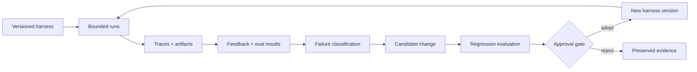

# Verified Improvement Loops

A workflow does not improve merely because it remembers something. It improves when evidence from one run leads to a controlled, testable change in later runs.

In plain language: keep the evidence, work out what actually failed, try the smallest change, and compare it with the current version before making it the new default.

## Three Loops

| Loop | Purpose | Ends When |
| --- | --- | --- |
| Do the work | Produce the requested result | the proposed output exists |
| Check the work | Test the result against the claim | required checks pass, fail, or remain explicitly unknown |
| Improve the workflow | Improve the system that produced the result | a reviewed change is adopted or rejected with evidence |

Collapsing these loops creates predictable errors. The system starts changing itself before the original result is understood, treats self-review as independent proof, or promotes a local workaround into a global rule.

## The Improvement Loop

## Keep Enough Evidence

Keep enough structured evidence to diagnose the system without preserving unnecessary sensitive content:

- harness and policy version;
- task class and synthetic or redacted case identifier;
- declared inputs and source categories;
- tool and routing events that affected the outcome;
- produced artifacts and unresolved questions;
- deterministic check results;
- human or independent review findings;
- failure classification;
- proposed change and expected effect;
- comparison between the proposed and current versions;
- adoption, rejection, or rollback decision.

Here, a trace means observable events and artifacts made available by the harness. It does not imply access to private model reasoning. Do not retain raw prompts, credentials, private documents, personal data, or unrestricted traces without a justified private retention policy. Public examples should use synthetic evidence.

## Diagnose Before Changing

Classify failures before adjusting the system:

| Failure Class | Likely Response |
| --- | --- |
| Unclear expectation | clarify an instruction, schema, required rule, or output |
| Expectation not followed | improve enforcement, control flow, or tool use |
| Missing capability | add or expose a narrowly scoped tool, skill, or source |
| Missing evidence | capture the state needed to distinguish causes |
| Invalid eval | repair the scorer, fixture, or claim before optimizing |
| Environmental failure | improve isolation, retry policy, or source availability |
| One-off exception | preserve locally; do not generalize without repeated evidence |

Changing the prompt is only one possible response. The better fix may be a validator, a clearer state shape, a routing rule, a better source boundary, or a recovery path.

## Adopting A Change

1. Freeze the current harness and evaluation baseline.
2. Turn the observed failure into a reproducible case when possible.
3. Define the intended change and the failure it should address.
4. Run the candidate against the existing suite and the new case.
5. Check for regressions, extra cost or latency, broader permissions, and more data exposure.
6. Review the diff and evidence at the required approval level.
7. Adopt a new version or reject the candidate without rewriting history.
8. Monitor later runs and retain a rollback path.

A proposed change should not edit the active harness in place while it is being evaluated. The current and proposed versions need distinct identities.

## Evaluation Boundaries

- A generated test can be useful, but it is not independent acceptance of the system that generated it.
- Agreement among agents can reveal consensus, but it does not establish correctness.
- A score is meaningful only for the claim, harness, data, budget, and environment actually tested.
- Hidden or independently controlled cases are useful when gaming or overfitting is plausible.
- Deterministic checks should own hard gates when the requirement can be expressed mechanically.
- Subjective quality still needs deliberate human or appropriately independent review.
- `FAIL`, `ERROR`, and `INCOMPLETE` should remain distinct states.

## Automation Levels

Increase automation only as evidence and reversibility improve:

1. Capture findings for a human to interpret.
2. Propose a change set for review.
3. Implement a candidate in isolation and run evals.
4. Open a change for approval with evidence attached.
5. Automatically adopt only narrow, reversible changes behind trusted gates.

Do not use successful low-risk automation as blanket evidence that higher-impact changes can safely bypass review.

## Threats To The Loop

| Risk | Control |
| --- | --- |
| Feedback poisoning | authenticate sources, preserve where evidence came from, require review for policy changes |
| Eval overfitting | use holdouts, counter-metrics, varied cases, and sample review |
| Privilege expansion | diff capabilities and permissions separately from behavior changes |
| Trace leakage | minimize collection, redact sensitive fields, separate public fixtures |
| Self-confirmation | add independent checks at consequential boundaries |
| Drift and pattern replication | run recurring invariant checks and retain a known-good baseline |
| Irreversible adoption | version changes, use staged rollout, and test rollback |

## Verification

An improvement loop is closed only when the evidence identifies what changed, why it should help, how it performed against the same expectations, who or what approved it, and how to reverse it.

## Sources

Checked on 2026-08-20 against [Agent improvement loop](https://developers.openai.com/cookbook/examples/agents_sdk/agent_improvement_loop), [Harness engineering](https://openai.com/index/harness-engineering/), and [A shared playbook for trustworthy third-party evaluations](https://openai.com/index/trustworthy-third-party-evaluations-foundations/).
